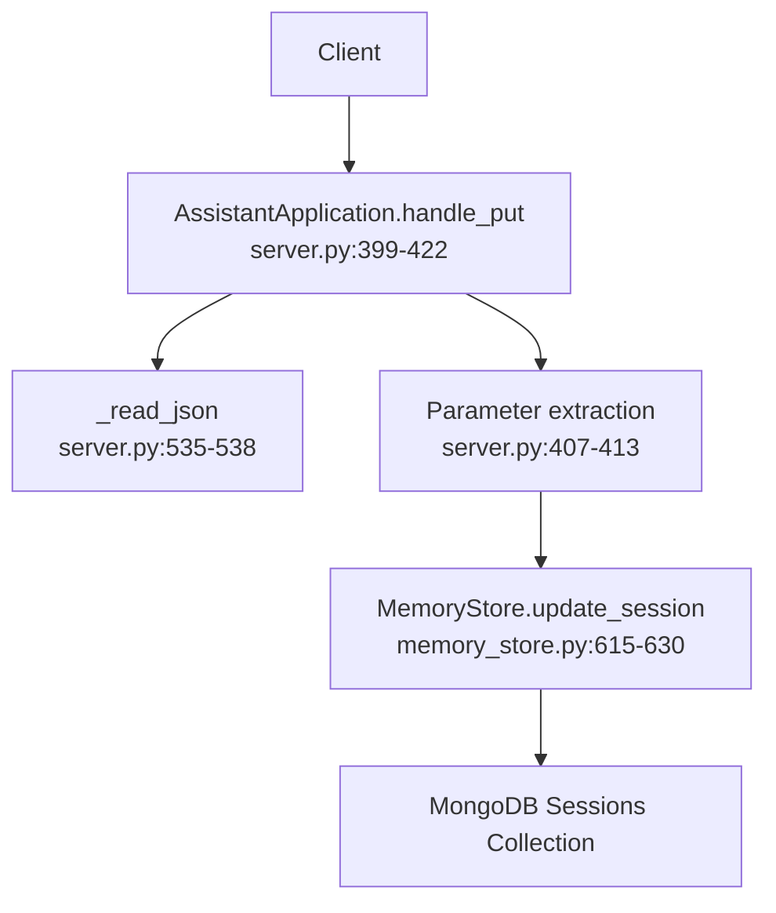
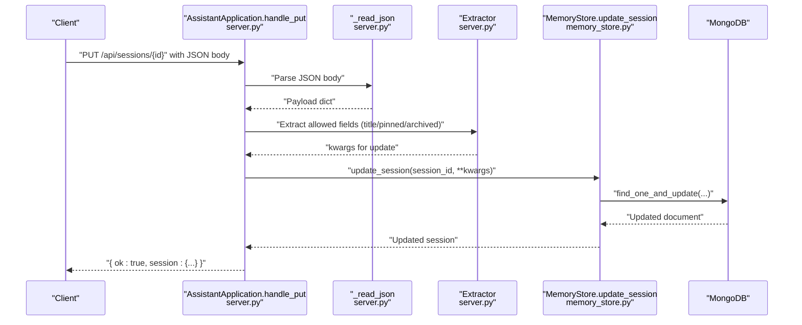
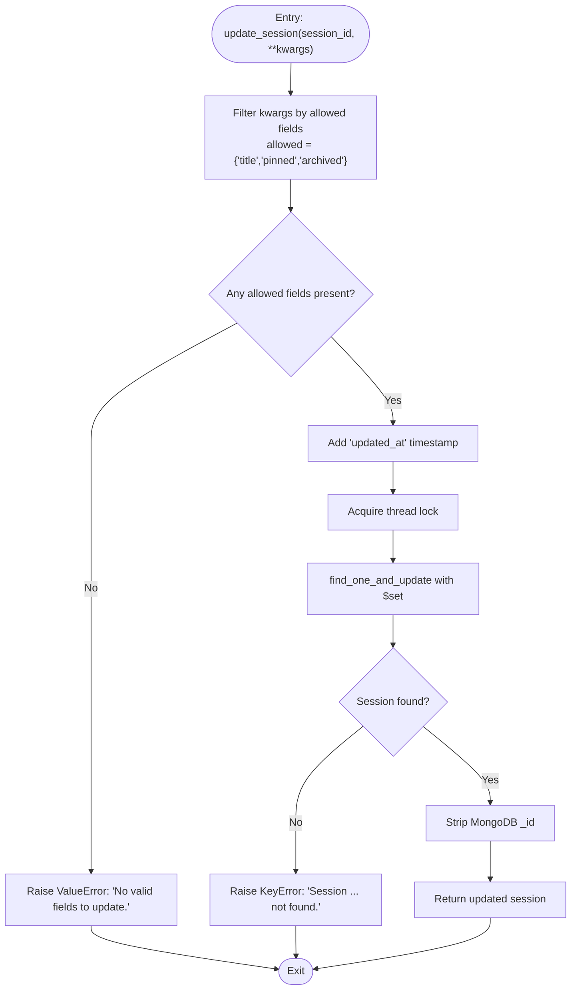
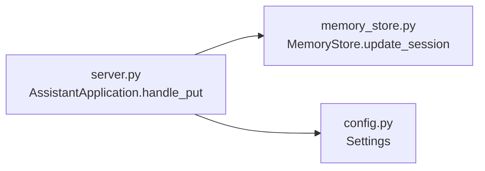

# PUT Request Handlers

<cite>
**Referenced Files in This Document**
- [server.py](file://backend/server.py)
- [memory_store.py](file://backend/core/memory_store.py)
- [config.py](file://backend/config.py)
</cite>

## Table of Contents
1. [Introduction](#introduction)
2. [Project Structure](#project-structure)
3. [Core Components](#core-components)
4. [Architecture Overview](#architecture-overview)
5. [Detailed Component Analysis](#detailed-component-analysis)
6. [Dependency Analysis](#dependency-analysis)
7. [Performance Considerations](#performance-considerations)
8. [Troubleshooting Guide](#troubleshooting-guide)
9. [Conclusion](#conclusion)

## Introduction
This document focuses on the PUT request handlers that manage resource updates, specifically the session update endpoint (/api/sessions/{id}). It explains how flexible parameter extraction works for title, pinned status, and archived state, the validation logic, error handling for missing or invalid session IDs, and how the update operation delegates to the MemoryStore. It also details the response structure and demonstrates practical examples of partial updates while maintaining backward compatibility with existing session data.

## Project Structure
The PUT handler resides in the backend HTTP server and delegates to the MemoryStore for persistence. The server routes requests based on path and HTTP method, parses JSON payloads, and returns standardized JSON responses.

**Diagram sources**
- [server.py:399-422](file://backend/server.py#L399-L422)
- [server.py:535-538](file://backend/server.py#L535-L538)
- [memory_store.py:615-630](file://backend/core/memory_store.py#L615-L630)

**Section sources**
- [server.py:399-422](file://backend/server.py#L399-L422)
- [server.py:535-538](file://backend/server.py#L535-L538)
- [memory_store.py:615-630](file://backend/core/memory_store.py#L615-L630)

## Core Components
- PUT handler for session updates: Parses the path to extract the session ID, extracts allowed fields from the JSON payload, validates inputs, and delegates to MemoryStore.
- MemoryStore.update_session: Validates allowed fields, constructs updates, persists to MongoDB, and returns the updated session document.

Key behaviors:
- Flexible parameter handling: Only provided fields (title, pinned, archived) are included in the update.
- Validation: Raises errors when no valid fields are provided or when the session does not exist.
- Delegation: The update operation is performed by MemoryStore.update_session.

**Section sources**
- [server.py:399-422](file://backend/server.py#L399-L422)
- [memory_store.py:615-630](file://backend/core/memory_store.py#L615-L630)

## Architecture Overview
The PUT flow for session updates follows a clear separation of concerns: HTTP routing and payload parsing in the server, parameter extraction and validation in the server, and persistence in the MemoryStore.

**Diagram sources**
- [server.py:399-422](file://backend/server.py#L399-L422)
- [server.py:535-538](file://backend/server.py#L535-L538)
- [memory_store.py:615-630](file://backend/core/memory_store.py#L615-L630)

## Detailed Component Analysis

### PUT /api/sessions/{id}: Session Update Endpoint
- Path extraction: The handler removes the "/api/sessions/" prefix and any trailing slashes to obtain the session ID.
- Parameter extraction: The handler checks for presence of title, pinned, and archived in the JSON payload and builds a kwargs dictionary accordingly.
- Validation and error handling:
  - If no valid fields are provided, the handler returns a BAD_REQUEST with an error message.
  - If the session does not exist, MemoryStore raises a KeyError which is caught and mapped to BAD_REQUEST.
- Delegation: The handler calls MemoryStore.update_session with the extracted kwargs.
- Response: On success, returns a JSON object containing ok: true and the updated session.

Practical examples of partial updates:
- Update only the title: Send a JSON body with title set to the new value; pinned and archived are ignored if not provided.
- Toggle pinned state: Send a JSON body with pinned set to true or false; title and archived are ignored if not provided.
- Archive a session: Send a JSON body with archived set to true; title and pinned are ignored if not provided.
- Combined updates: Send a JSON body with multiple fields (e.g., title and pinned) to update them atomically.

Backward compatibility:
- The endpoint preserves existing session fields not included in the request.
- The response includes the full session document, ensuring clients can rely on consistent field sets.

**Section sources**
- [server.py:399-422](file://backend/server.py#L399-L422)
- [server.py:407-413](file://backend/server.py#L407-L413)
- [server.py:415-419](file://backend/server.py#L415-L419)

### MemoryStore.update_session: Update Operation
- Allowed fields: Only title, pinned, and archived are accepted; any other fields are filtered out.
- Validation: If no allowed fields are present, raises ValueError indicating no valid fields to update.
- Persistence: Updates the session document atomically using find_one_and_update with $set, adding updated_at.
- Existence check: If the session does not exist, raises KeyError with a descriptive message.
- Response: Returns the updated session document with the MongoDB _id removed.

**Diagram sources**
- [memory_store.py:615-630](file://backend/core/memory_store.py#L615-L630)

**Section sources**
- [memory_store.py:615-630](file://backend/core/memory_store.py#L615-L630)

### Error Handling and Validation
- Missing or invalid session ID:
  - If the path does not contain a valid session ID after stripping prefixes, the handler returns NOT_FOUND.
  - If the session does not exist, MemoryStore.update_session raises KeyError, which the handler catches and returns BAD_REQUEST with an error message.
- Invalid payload:
  - If no allowed fields are provided, MemoryStore.update_session raises ValueError, which the handler catches and returns BAD_REQUEST with an error message.
- Response structure:
  - Success: { ok: true, session: { ... } }
  - Error: { error: "<message>" }, with appropriate HTTP status (BAD_REQUEST or NOT_FOUND)

**Section sources**
- [server.py:407-419](file://backend/server.py#L407-L419)
- [memory_store.py:618-629](file://backend/core/memory_store.py#L618-L629)

## Dependency Analysis
The PUT handler depends on:
- Path parsing and JSON reading utilities in the server.
- MemoryStore.update_session for database operations.

**Diagram sources**
- [server.py:399-422](file://backend/server.py#L399-L422)
- [memory_store.py:615-630](file://backend/core/memory_store.py#L615-L630)
- [config.py:20-76](file://backend/config.py#L20-L76)

**Section sources**
- [server.py:399-422](file://backend/server.py#L399-L422)
- [memory_store.py:615-630](file://backend/core/memory_store.py#L615-L630)
- [config.py:20-76](file://backend/config.py#L20-L76)

## Performance Considerations
- Atomic updates: MemoryStore.update_session performs an atomic find_and_modify operation, minimizing race conditions.
- Index usage: MongoDB indexes on session_id and composite indexes on pinned and updated_at optimize retrieval and sorting.
- Concurrency: Thread locks protect write operations to prevent concurrent modifications.

[No sources needed since this section provides general guidance]

## Troubleshooting Guide
Common issues and resolutions:
- Session not found: Ensure the session ID in the path is correct and exists in the database.
- No valid fields to update: Include at least one of title, pinned, or archived in the JSON body.
- Unexpected error responses: Verify the JSON body is well-formed and contains only allowed fields.

**Section sources**
- [server.py:415-419](file://backend/server.py#L415-L419)
- [memory_store.py:618-629](file://backend/core/memory_store.py#L618-L629)

## Conclusion
The PUT handler for /api/sessions/{id} provides a robust, flexible mechanism for updating session attributes. It supports partial updates, validates inputs, and delegates persistence to MemoryStore, ensuring atomicity and consistency. The response structure is straightforward and maintains backward compatibility, enabling clients to rely on consistent session data.