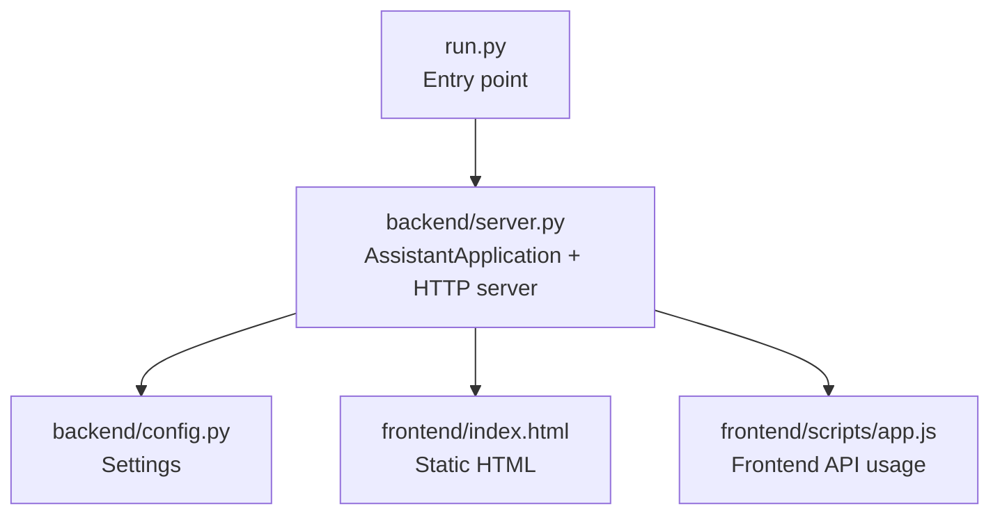
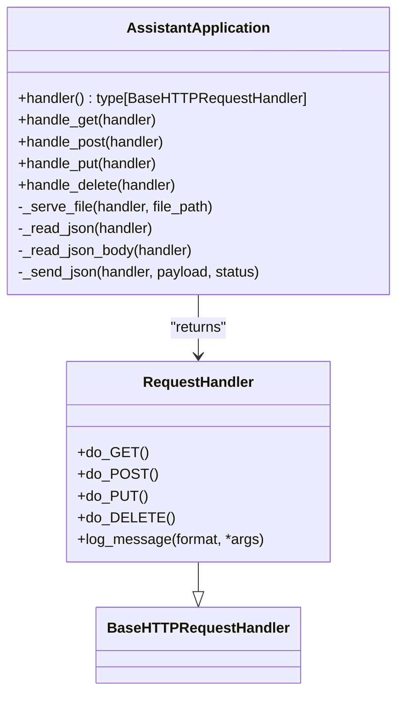
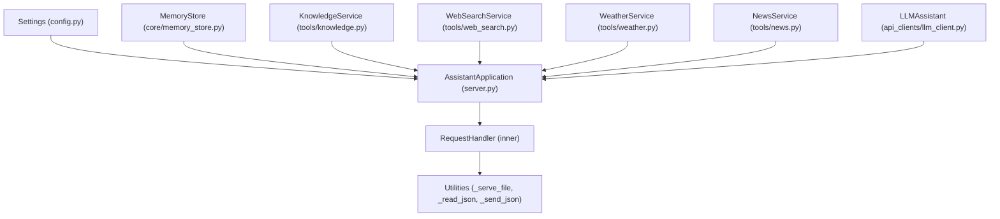

# Request Routing and Handlers

<cite>
**Referenced Files in This Document**
- [run.py](file://run.py)
- [backend/server.py](file://backend/server.py)
- [backend/config.py](file://backend/config.py)
- [frontend/index.html](file://frontend/index.html)
- [frontend/scripts/app.js](file://frontend/scripts/app.js)
</cite>

## Table of Contents
1. [Introduction](#introduction)
2. [Project Structure](#project-structure)
3. [Core Components](#core-components)
4. [Architecture Overview](#architecture-overview)
5. [Detailed Component Analysis](#detailed-component-analysis)
6. [Dependency Analysis](#dependency-analysis)
7. [Performance Considerations](#performance-considerations)
8. [Troubleshooting Guide](#troubleshooting-guide)
9. [Conclusion](#conclusion)

## Introduction
This document explains the HTTP request routing and handler system used by the backend server. It focuses on how BaseHTTPRequestHandler is inherited and how the four main HTTP method handlers (GET, POST, PUT, DELETE) are implemented. It also covers URL path routing logic (frontend asset serving, API endpoint routing), parameter extraction using urlparse and parse_qs, request preprocessing (JSON body parsing, content-length validation), error handling strategies, and the handler delegation pattern where AssistantApplication methods delegate to specific handler functions. Practical examples of request-response cycles, URL pattern matching, and parameter extraction are included to help developers and operators understand and extend the system.

## Project Structure
The HTTP server is implemented in the backend module and serves both static frontend assets and dynamic API endpoints. The entry point initializes the server and delegates HTTP handling to an inner class that inherits from BaseHTTPRequestHandler.



**Diagram sources**
- [run.py:1-6](file://run.py#L1-L6)
- [backend/server.py:64-83](file://backend/server.py#L64-L83)
- [backend/config.py:55-76](file://backend/config.py#L55-L76)
- [frontend/index.html:1-338](file://frontend/index.html#L1-L338)
- [frontend/scripts/app.js:902-1087](file://frontend/scripts/app.js#L902-L1087)

**Section sources**
- [run.py:1-6](file://run.py#L1-L6)
- [backend/server.py:64-83](file://backend/server.py#L64-L83)
- [backend/config.py:55-76](file://backend/config.py#L55-L76)

## Core Components
- AssistantApplication: Central orchestrator that holds application state and exposes a handler method returning a BaseHTTPRequestHandler subclass.
- Inner RequestHandler: Inherits from BaseHTTPRequestHandler and delegates each HTTP method to AssistantApplication’s handler methods.
- Handler methods: handle_get, handle_post, handle_put, handle_delete implement routing and business logic.
- Utilities: _serve_file, _read_json, _read_json_body, _send_json encapsulate static file serving, JSON parsing, and response writing.
- Settings: Provides configuration including web_dir, data_dir, ports, and provider settings.

Key responsibilities:
- Route requests by path and method.
- Serve static frontend assets from web_dir.
- Parse JSON bodies and query parameters.
- Validate content-length and handle errors gracefully.
- Delegate to domain services (memory store, tools, LLM client).

**Section sources**
- [backend/server.py:23-63](file://backend/server.py#L23-L63)
- [backend/server.py:64-83](file://backend/server.py#L64-L83)
- [backend/server.py:85-564](file://backend/server.py#L85-L564)
- [backend/config.py:20-76](file://backend/config.py#L20-L76)

## Architecture Overview
The server runs a ThreadingHTTPServer bound to localhost and the configured port. Each incoming request is handled by an instance of the inner RequestHandler class, which delegates to AssistantApplication methods based on HTTP method and path.

```mermaid
sequenceDiagram
participant Client as "Browser"
participant Server as "ThreadingHTTPServer"
participant Handler as "RequestHandler (inner)"
participant App as "AssistantApplication"
participant FS as "_serve_file"
participant JSON as "_read_json/_read_json_body"
participant Resp as "_send_json"
Client->>Server : "HTTP request"
Server->>Handler : "Dispatch to inner class"
alt "GET"
Handler->>App : "handle_get(handler)"
opt "Static asset"
App->>FS : "_serve_file(handler, file_path)"
FS-->>Client : "200 OK + Content-Type + Body"
else "API endpoint"
App->>Resp : "_send_json(handler, payload)"
Resp-->>Client : "200 OK + JSON"
end
else "POST"
Handler->>App : "handle_post(handler)"
App->>JSON : "_read_json(handler)"
App->>Resp : "_send_json(handler, payload)"
Resp-->>Client : "200 OK + JSON"
else "PUT"
Handler->>App : "handle_put(handler)"
App->>JSON : "_read_json(handler)"
App->>Resp : "_send_json(handler, payload)"
Resp-->>Client : "200 OK + JSON"
else "DELETE"
Handler->>App : "handle_delete(handler)"
App->>Resp : "_send_json(handler, payload)"
Resp-->>Client : "200 OK + JSON"
end
```

**Diagram sources**
- [backend/server.py:64-83](file://backend/server.py#L64-L83)
- [backend/server.py:85-564](file://backend/server.py#L85-L564)

## Detailed Component Analysis

### BaseHTTPRequestHandler Inheritance Pattern
- The inner RequestHandler class inherits from BaseHTTPRequestHandler.
- It overrides do_GET, do_POST, do_PUT, do_DELETE to delegate to AssistantApplication methods.
- It suppresses logging via log_message to reduce noise.



**Diagram sources**
- [backend/server.py:64-83](file://backend/server.py#L64-L83)
- [backend/server.py:85-564](file://backend/server.py#L85-L564)

**Section sources**
- [backend/server.py:64-83](file://backend/server.py#L64-L83)

### URL Path Routing Logic
Routing is performed by inspecting handler.path and using urlparse to separate path and query components. The logic distinguishes:
- Frontend asset serving: Root and specific static paths under web_dir.
- API endpoints: Paths under /api/ with method-specific logic.
- Parameter extraction: parse_qs for query parameters; path segment parsing for resource identifiers.

Examples of routes:
- Frontend: "/", "/index.html", "/styles.css", "/app.js", "/avatar-worker.js", "/avatar-renderer.js".
- Sessions: "/api/sessions", "/api/sessions/{id}", "/api/sessions/{id}/messages", "/api/sessions/{id}/attachments".
- Weather and News: "/api/weather?location=...", "/api/news?topic=...".
- Chat and profile: "/api/chat", "/api/profile", "/api/tasks", "/api/tasks/complete", "/api/notes".

**Section sources**
- [backend/server.py:85-167](file://backend/server.py#L85-L167)
- [backend/server.py:169-265](file://backend/server.py#L169-L265)
- [backend/server.py:399-500](file://backend/server.py#L399-L500)

### Parameter Extraction Using urlparse and parse_qs
- urlparse(handler.path) separates scheme, netloc, path, params, query, fragment.
- parse_qs(parsed.query) parses query string into a dict mapping keys to lists of values.
- Path segments are extracted by splitting on "/" and stripping empty parts.

Common patterns:
- Query parameters: location, topic, include_archived, limit, sessionId.
- Path parameters: session_id extracted from "/api/sessions/{id}" or "/api/sessions/{id}/messages".

**Section sources**
- [backend/server.py:86](file://backend/server.py#L86)
- [backend/server.py:112-113](file://backend/server.py#L112-L113)
- [backend/server.py:131-132](file://backend/server.py#L131-L132)
- [backend/server.py:146-147](file://backend/server.py#L146-L147)
- [backend/server.py:189-190](file://backend/server.py#L189-L190)

### Request Preprocessing: JSON Body Parsing and Validation
- _read_json(handler): Reads Content-Length bytes from handler.rfile, decodes UTF-8, parses JSON; defaults to {} when empty.
- _read_json_body(handler): Similar but defaults to [] and returns [] on JSONDecodeError for endpoints expecting arrays.
- Content-Length validation: Uses handler.headers.get("Content-Length", "0") to guard reads.

Error handling:
- On JSON decode failure, endpoints return structured error payloads with HTTP 400.
- On missing or invalid parameters, endpoints return HTTP 400 with error messages.

**Section sources**
- [backend/server.py:535-548](file://backend/server.py#L535-L548)
- [backend/server.py:172-178](file://backend/server.py#L172-L178)
- [backend/server.py:198-200](file://backend/server.py#L198-L200)
- [backend/server.py:229-231](file://backend/server.py#L229-L231)
- [backend/server.py:237-240](file://backend/server.py#L237-L240)
- [backend/server.py:249-251](file://backend/server.py#L249-L251)

### Handler Delegation Pattern
Each HTTP method is delegated to an AssistantApplication method:
- GET: handle_get routes to static assets or API endpoints.
- POST: handle_post handles creation, updates, uploads, and chat.
- PUT: handle_put updates session attributes.
- DELETE: handle_delete removes sessions, attachments, messages, notes, and tasks.

These methods call shared utilities for JSON parsing, file serving, and response sending.

**Section sources**
- [backend/server.py:67-78](file://backend/server.py#L67-L78)
- [backend/server.py:85-167](file://backend/server.py#L85-L167)
- [backend/server.py:169-265](file://backend/server.py#L169-L265)
- [backend/server.py:399-500](file://backend/server.py#L399-L500)

### Four Main HTTP Method Handlers

#### GET Handler
Responsibilities:
- Serve frontend assets from web_dir.
- Return application state via /api/state.
- List sessions and fetch session details.
- Retrieve messages and attachments for a session.
- Fetch weather and news with query parameters.

Key logic:
- Static asset checks for "/", "/index.html", "/styles.css", "/app.js", "/avatar-worker.js", "/avatar-renderer.js".
- Query parameter parsing for include_archived, limit, location, topic.
- Path parsing for session_id extraction.

**Section sources**
- [backend/server.py:85-167](file://backend/server.py#L85-L167)

#### POST Handler
Responsibilities:
- Create a new session via /api/sessions.
- Add messages to a session via /api/sessions/{id}/messages.
- Upload attachments via /api/sessions/{id}/attachments.
- Submit chat requests via /api/chat.
- Update profile via /api/profile.
- Add tasks and mark tasks as complete via /api/tasks and /api/tasks/complete.
- Remember notes via /api/notes.
- Graceful fallback for unsupported features like image generation.

Key logic:
- JSON parsing via _read_json and _read_json_body.
- Validation and error responses for malformed inputs.
- Delegation to domain services (memory store, tools, LLM client).

**Section sources**
- [backend/server.py:169-265](file://backend/server.py#L169-L265)

#### PUT Handler
Responsibilities:
- Update a session’s title, pinned, or archived flags via /api/sessions/{id}.

Key logic:
- Extract session_id from path.
- Build kwargs from payload keys and update the session.

**Section sources**
- [backend/server.py:399-422](file://backend/server.py#L399-L422)

#### DELETE Handler
Responsibilities:
- Delete a session via /api/sessions/{id}.
- Delete a specific attachment via /api/sessions/{id}/attachments/{attachment_id}.
- Delete a message via /api/messages/{message_id}.
- Delete a note via /api/notes/{note_id}.
- Delete a task via /api/tasks/{task_id} (excluding /api/tasks/complete).

Key logic:
- Path parsing to extract session_id and attachment_id/message_id/task_id.
- Cleanup of uploaded files and knowledge cache invalidation.

**Section sources**
- [backend/server.py:428-500](file://backend/server.py#L428-L500)

### Practical Examples

#### Example 1: GET /api/state
- Request: GET /api/state with no body.
- Response: JSON payload containing provider, API key presence, model, default location, live voice name, memory, history, and sessions.
- Error: Not found if route mismatches (handled by fallback).

**Section sources**
- [backend/server.py:106-108](file://backend/server.py#L106-L108)
- [backend/server.py:506-520](file://backend/server.py#L506-L520)

#### Example 2: GET /api/sessions/{id}/messages?limit=10
- Request: GET /api/sessions/{id}/messages?limit=10.
- Path parsing: Extract session_id from path.
- Query parsing: limit is parsed and converted to int.
- Response: JSON with messages array.

**Section sources**
- [backend/server.py:128-135](file://backend/server.py#L128-L135)

#### Example 3: POST /api/chat
- Request: POST /api/chat with JSON body including message, conversation, screenImage, mode, coachTopic, coachLevel, preferredLanguage, webSearchOnly, offlineMode, sessionId.
- JSON parsing: _read_json reads and parses the body.
- Response: JSON with reply, toolEvents, memory, model.

**Section sources**
- [backend/server.py:211-213](file://backend/server.py#L211-L213)
- [backend/server.py:276-321](file://backend/server.py#L276-L321)

#### Example 4: POST /api/sessions/{id}/attachments
- Request: POST /api/sessions/{id}/attachments with JSON body containing filename and data (base64).
- Validation: Checks for allowed file types and size limits.
- Response: JSON with ok and attachment metadata.

**Section sources**
- [backend/server.py:204-209](file://backend/server.py#L204-L209)
- [backend/server.py:329-394](file://backend/server.py#L329-L394)

#### Example 5: PUT /api/sessions/{id}
- Request: PUT /api/sessions/{id} with JSON body containing title, pinned, or archived.
- Response: JSON with ok and updated session.

**Section sources**
- [backend/server.py:403-422](file://backend/server.py#L403-L422)

#### Example 6: DELETE /api/sessions/{id}
- Request: DELETE /api/sessions/{id}.
- Response: JSON with ok; cleans up attachments and knowledge cache.

**Section sources**
- [backend/server.py:431-446](file://backend/server.py#L431-L446)

### Frontend Integration
The frontend (index.html and app.js) interacts with the backend via fetch calls:
- Refresh state: GET /api/state.
- Create session: POST /api/sessions.
- Add messages: POST /api/sessions/{id}/messages.
- Chat: POST /api/chat.
- Update session: PUT /api/sessions/{id}.
- Delete session: DELETE /api/sessions/{id}.

These calls demonstrate how the frontend expects the backend to implement the documented routes and return JSON responses.

**Section sources**
- [frontend/index.html:1-338](file://frontend/index.html#L1-L338)
- [frontend/scripts/app.js:902-1087](file://frontend/scripts/app.js#L902-L1087)

## Dependency Analysis
- AssistantApplication depends on Settings for configuration, MemoryStore for persistence, KnowledgeService for RAG, WebSearchService for web search, WeatherService for weather, NewsService for news, and LLMAssistant for chat.
- RequestHandler depends on AssistantApplication for routing and business logic.
- Utilities depend on standard library modules (urllib.parse, json, mimetypes, http.server).



**Diagram sources**
- [backend/server.py:23-63](file://backend/server.py#L23-L63)
- [backend/server.py:64-83](file://backend/server.py#L64-L83)
- [backend/server.py:522-564](file://backend/server.py#L522-L564)

**Section sources**
- [backend/server.py:23-63](file://backend/server.py#L23-L63)
- [backend/server.py:64-83](file://backend/server.py#L64-L83)
- [backend/server.py:522-564](file://backend/server.py#L522-L564)

## Performance Considerations
- ThreadingHTTPServer: Each request is handled in a separate thread, enabling concurrent clients.
- Static file serving: _serve_file reads entire files into memory; for large assets, consider streaming or caching strategies.
- JSON parsing: _read_json and _read_json_body read Content-Length bytes; ensure clients set Content-Length correctly to avoid blocking reads.
- Error handling: Early exits with _send_json prevent unnecessary processing and reduce latency.

[No sources needed since this section provides general guidance]

## Troubleshooting Guide
Common issues and resolutions:
- 404 Not Found: Occurs when a route is not matched. Verify path correctness and trailing slashes.
- 400 Bad Request: Returned for invalid JSON, missing parameters, or unsupported file types/sizes. Check request body and query parameters.
- ConnectionAbortedError: _send_json catches and ignores connection aborts to prevent crashes.
- Static asset not served: Ensure web_dir points to the correct directory and file permissions are readable.

**Section sources**
- [backend/server.py:167](file://backend/server.py#L167)
- [backend/server.py:237-240](file://backend/server.py#L237-L240)
- [backend/server.py:341-347](file://backend/server.py#L341-L347)
- [backend/server.py:355-361](file://backend/server.py#L355-L361)
- [backend/server.py:562-563](file://backend/server.py#L562-L563)

## Conclusion
The HTTP request routing and handler system is built around a clear delegation pattern: BaseHTTPRequestHandler subclasses are generated by AssistantApplication and delegate to dedicated handler methods. URL routing uses path and query parsing to serve static assets and implement API endpoints. Request preprocessing ensures robust JSON parsing and validation, while error handling provides consistent responses. Together, these components deliver a reliable, extensible backend for the Orbit Virtual Assistant.