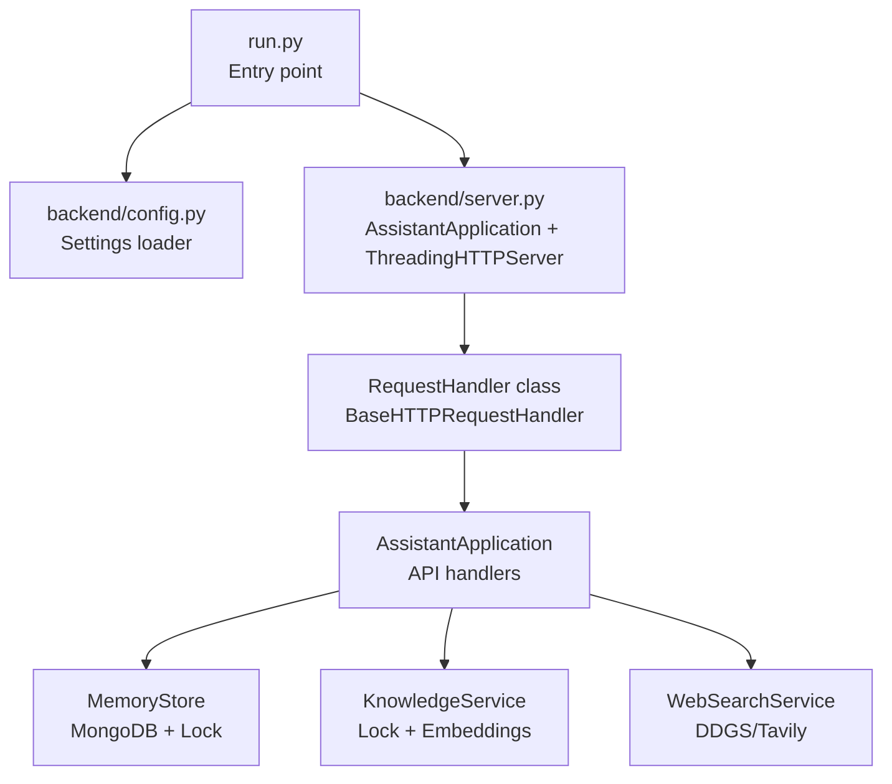
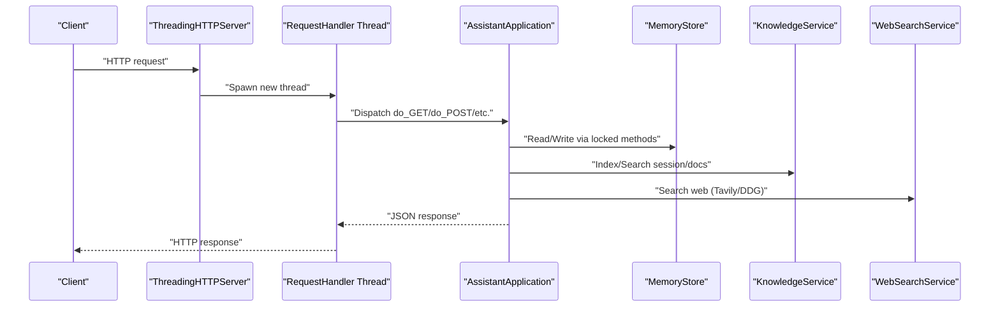
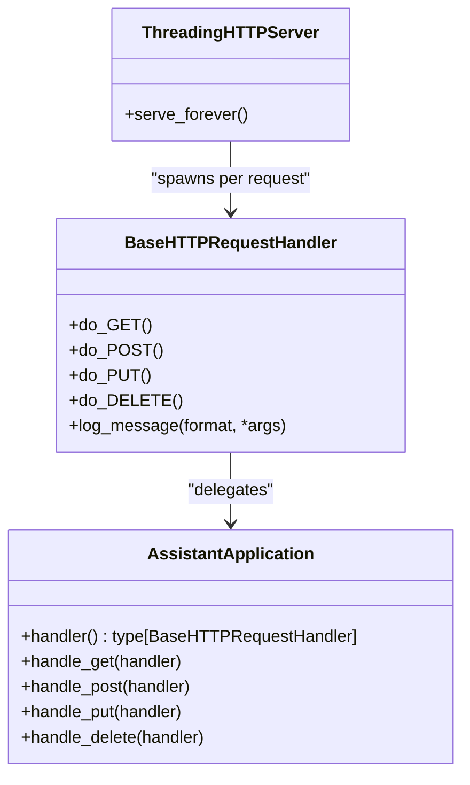
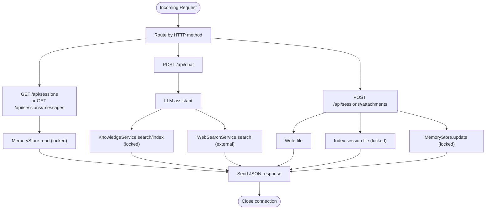
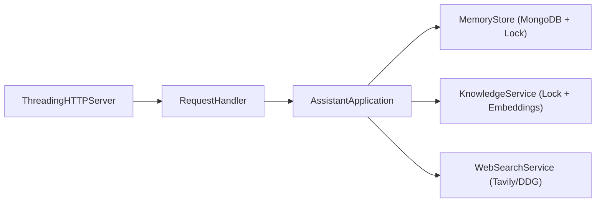

# Threading Architecture and Concurrency

<cite>
**Referenced Files in This Document**
- [backend/server.py](file://backend/server.py)
- [backend/config.py](file://backend/config.py)
- [backend/core/memory_store.py](file://backend/core/memory_store.py)
- [backend/tools/knowledge.py](file://backend/tools/knowledge.py)
- [backend/tools/web_search.py](file://backend/tools/web_search.py)
- [run.py](file://run.py)
- [README.md](file://README.md)
</cite>

## Table of Contents
1. [Introduction](#introduction)
2. [Project Structure](#project-structure)
3. [Core Components](#core-components)
4. [Architecture Overview](#architecture-overview)
5. [Detailed Component Analysis](#detailed-component-analysis)
6. [Dependency Analysis](#dependency-analysis)
7. [Performance Considerations](#performance-considerations)
8. [Troubleshooting Guide](#troubleshooting-guide)
9. [Conclusion](#conclusion)

## Introduction
This document explains the threading architecture and concurrency model of the backend HTTP server. The system uses Python’s ThreadingHTTPServer to handle multiple concurrent requests by spawning a new thread for each incoming HTTP request. The BaseHTTPRequestHandler subclass delegates request handling to a dedicated AssistantApplication instance, which coordinates database access, tool services, and response generation. Thread safety is ensured primarily through a global lock in the MongoDB-backed MemoryStore and careful handling of shared resources in the KnowledgeService and WebSearchService. Practical implications include improved responsiveness under moderate load, but also potential contention and resource overhead under heavy concurrency.

## Project Structure
The threading-enabled server is implemented in the backend module. The entry point initializes settings, constructs the AssistantApplication, and starts ThreadingHTTPServer bound to localhost and a configured port. The server registers a RequestHandler class that routes HTTP methods to AssistantApplication handlers.

**Diagram sources**
- [run.py:1-6](file://run.py#L1-L6)
- [backend/config.py:55-76](file://backend/config.py#L55-L76)
- [backend/server.py:63-83](file://backend/server.py#L63-L83)
- [backend/server.py:607-611](file://backend/server.py#L607-L611)
- [backend/core/memory_store.py:83-117](file://backend/core/memory_store.py#L83-L117)
- [backend/tools/knowledge.py:107-108](file://backend/tools/knowledge.py#L107-L108)
- [backend/tools/web_search.py:53-68](file://backend/tools/web_search.py#L53-L68)

**Section sources**
- [README.md:54-64](file://README.md#L54-L64)
- [run.py:1-6](file://run.py#L1-L6)
- [backend/config.py:55-76](file://backend/config.py#L55-L76)
- [backend/server.py:607-611](file://backend/server.py#L607-L611)

## Core Components
- ThreadingHTTPServer: Spawns a new thread per incoming request, enabling concurrent request handling.
- BaseHTTPRequestHandler subclass: Delegates HTTP verbs to AssistantApplication methods.
- AssistantApplication: Central orchestrator for routing, file serving, and invoking tool services.
- MemoryStore: MongoDB-backed persistence with a threading.Lock to guard critical sections.
- KnowledgeService: Manages session and persistent knowledge indexing/search with a threading.Lock.
- WebSearchService: Provides web search via Tavily and DuckDuckGo, with a SpinnerTimer thread for progress indication.

**Section sources**
- [backend/server.py:63-83](file://backend/server.py#L63-L83)
- [backend/server.py:607-611](file://backend/server.py#L607-L611)
- [backend/core/memory_store.py:83-117](file://backend/core/memory_store.py#L83-L117)
- [backend/tools/knowledge.py:107-108](file://backend/tools/knowledge.py#L107-L108)
- [backend/tools/web_search.py:12-41](file://backend/tools/web_search.py#L12-L41)

## Architecture Overview
The server runs a loop that accepts connections and spawns threads for each request. Each thread executes the RequestHandler, which calls AssistantApplication methods based on the HTTP verb. These methods coordinate with MemoryStore (MongoDB), KnowledgeService (RAG), and WebSearchService (external search). Thread safety is enforced by locks around database operations and shared caches.

**Diagram sources**
- [backend/server.py:63-83](file://backend/server.py#L63-L83)
- [backend/server.py:85-168](file://backend/server.py#L85-L168)
- [backend/server.py:169-266](file://backend/server.py#L169-L266)
- [backend/core/memory_store.py:194-250](file://backend/core/memory_store.py#L194-L250)
- [backend/tools/knowledge.py:303-335](file://backend/tools/knowledge.py#L303-L335)
- [backend/tools/web_search.py:69-104](file://backend/tools/web_search.py#L69-L104)

## Detailed Component Analysis

### ThreadingHTTPServer and BaseHTTPRequestHandler Pattern
- ThreadingHTTPServer creates a new thread for each incoming TCP connection. The RequestHandler subclass overrides HTTP verb methods to delegate to AssistantApplication methods.
- The RequestHandler does not override the constructor or threading hooks; it relies on the server to manage thread creation and lifecycle.
- Logging is suppressed inside the handler to reduce console noise during concurrent requests.

**Diagram sources**
- [backend/server.py:63-83](file://backend/server.py#L63-L83)
- [backend/server.py:607-611](file://backend/server.py#L607-L611)

**Section sources**
- [backend/server.py:63-83](file://backend/server.py#L63-L83)
- [backend/server.py:607-611](file://backend/server.py#L607-L611)

### Connection Management and Thread Lifecycle
- Each request is handled in a separate thread started by the server. There is no explicit thread pool or worker queue; threads are created on demand.
- The server remains in serve_forever() until terminated. Threads terminate automatically after the request is processed and the socket is closed.
- The handler’s log_message is overridden to suppress logs, reducing overhead and noise.

Practical implications:
- Low latency for short-lived requests.
- Resource growth proportional to concurrent connections; long-lived connections increase memory footprint.
- No backpressure mechanism; high concurrency can lead to thread exhaustion.

**Section sources**
- [backend/server.py:607-611](file://backend/server.py#L607-L611)
- [backend/server.py:80-82](file://backend/server.py#L80-L82)

### Thread Safety and Resource Allocation Strategies
- MemoryStore uses a threading.Lock to serialize access to MongoDB operations, preventing race conditions across concurrent requests.
- KnowledgeService uses a threading.Lock to protect its in-memory session retrievers cache and to guard shared state during indexing.
- WebSearchService uses a SpinnerTimer thread to show progress; the timer thread is started per operation and joined on completion.
- AssistantApplication methods read request bodies and write responses using BaseHTTPRequestHandler’s streams, which are not shared across threads because each request runs in its own thread.

Resource allocation:
- MongoDB connections are managed by the MongoClient; the application holds a single client instance and uses it across threads, protected by a lock.
- KnowledgeService maintains a dictionary of session retrievers keyed by session_id; the lock ensures safe mutation and access.
- WebSearchService holds optional clients for Tavily and DuckDuckGo; these are initialized once and reused safely.

Potential pitfalls:
- Long-running operations (e.g., web search, RAG indexing) hold the lock for extended periods, blocking other requests.
- Embedding model initialization occurs once; however, embedding calls themselves are not guarded by a lock, potentially causing contention if multiple threads call the embedding model concurrently.

**Section sources**
- [backend/core/memory_store.py:83-117](file://backend/core/memory_store.py#L83-L117)
- [backend/core/memory_store.py:194-250](file://backend/core/memory_store.py#L194-L250)
- [backend/tools/knowledge.py:107-108](file://backend/tools/knowledge.py#L107-L108)
- [backend/tools/knowledge.py:331-332](file://backend/tools/knowledge.py#L331-L332)
- [backend/tools/web_search.py:12-41](file://backend/tools/web_search.py#L12-L41)

### Concurrent Request Handling Examples
- GET /api/sessions and GET /api/sessions/<id>/messages: Both read from MemoryStore; the lock serializes these operations, allowing concurrent requests to other endpoints to proceed.
- POST /api/chat: Calls the LLM assistant; if the assistant performs web search or RAG, those operations are coordinated with the KnowledgeService and WebSearchService, which are protected by their respective locks.
- POST /api/sessions/<id>/attachments: Decodes base64 data, writes to disk, and indexes content; the indexing path invalidates cached retrievers and updates MongoDB via MemoryStore, all under lock.

**Diagram sources**
- [backend/server.py:85-168](file://backend/server.py#L85-L168)
- [backend/server.py:169-266](file://backend/server.py#L169-L266)
- [backend/core/memory_store.py:194-250](file://backend/core/memory_store.py#L194-L250)
- [backend/tools/knowledge.py:303-335](file://backend/tools/knowledge.py#L303-L335)
- [backend/tools/web_search.py:69-104](file://backend/tools/web_search.py#L69-L104)

**Section sources**
- [backend/server.py:85-168](file://backend/server.py#L85-L168)
- [backend/server.py:169-266](file://backend/server.py#L169-L266)
- [backend/core/memory_store.py:194-250](file://backend/core/memory_store.py#L194-L250)
- [backend/tools/knowledge.py:303-335](file://backend/tools/knowledge.py#L303-L335)
- [backend/tools/web_search.py:69-104](file://backend/tools/web_search.py#L69-L104)

### Debugging Multi-threaded Applications
- Use minimal logging in the handler to reduce noise; the handler suppresses log_message.
- Monitor thread count and resource usage externally (e.g., OS process monitor) to detect runaway threads.
- For long-running operations, consider adding structured timing and logging around lock-protected regions to identify hotspots.
- Validate that all shared mutable state is protected by locks (e.g., session retrievers cache, MongoDB operations).

**Section sources**
- [backend/server.py:80-82](file://backend/server.py#L80-L82)
- [backend/tools/knowledge.py:107-108](file://backend/tools/knowledge.py#L107-L108)
- [backend/core/memory_store.py:83-117](file://backend/core/memory_store.py#L83-L117)

## Dependency Analysis
The threading architecture depends on:
- Python’s http.server ThreadingHTTPServer and BaseHTTPRequestHandler.
- AssistantApplication to route and orchestrate request handling.
- MemoryStore for persistence with a lock.
- KnowledgeService for RAG with a lock and optional embeddings.
- WebSearchService for external search with optional clients.

**Diagram sources**
- [backend/server.py:607-611](file://backend/server.py#L607-L611)
- [backend/server.py:63-83](file://backend/server.py#L63-L83)
- [backend/core/memory_store.py:83-117](file://backend/core/memory_store.py#L83-L117)
- [backend/tools/knowledge.py:107-108](file://backend/tools/knowledge.py#L107-L108)
- [backend/tools/web_search.py:69-104](file://backend/tools/web_search.py#L69-L104)

**Section sources**
- [backend/server.py:607-611](file://backend/server.py#L607-L611)
- [backend/server.py:63-83](file://backend/server.py#L63-L83)
- [backend/core/memory_store.py:83-117](file://backend/core/memory_store.py#L83-L117)
- [backend/tools/knowledge.py:107-108](file://backend/tools/knowledge.py#L107-L108)
- [backend/tools/web_search.py:69-104](file://backend/tools/web_search.py#L69-L104)

## Performance Considerations
- Throughput: ThreadingHTTPServer scales horizontally with CPU cores; each request runs independently, improving throughput under moderate concurrency.
- Contention: MemoryStore and KnowledgeService locks serialize database and cache operations, which can become bottlenecks under heavy load.
- Latency: Short requests benefit from low overhead; long-running operations (web search, RAG indexing) dominate total latency.
- Resource usage: Each thread consumes memory and OS resources; sustained high concurrency increases memory footprint and context-switching overhead.
- Scalability limits: Python’s GIL does not constrain I/O-bound tasks, but CPU-bound operations (e.g., embedding generation) can still bottleneck. Consider offloading CPU-heavy tasks to separate processes or async workers.

[No sources needed since this section provides general guidance]

## Troubleshooting Guide
- Symptoms: Slow responses under load, increased memory usage, or thread exhaustion.
  - Actions: Reduce concurrent requests, optimize long-running operations, or switch to an asynchronous or process-based model.
- Symptoms: Data inconsistencies or errors during concurrent writes.
  - Actions: Verify that all MongoDB operations are protected by MemoryStore’s lock; ensure KnowledgeService cache updates are synchronized.
- Symptoms: Progress indicators not appearing or stuck timers.
  - Actions: Confirm SpinnerTimer threads are started and joined correctly in WebSearchService and KnowledgeService.

**Section sources**
- [backend/core/memory_store.py:83-117](file://backend/core/memory_store.py#L83-L117)
- [backend/tools/knowledge.py:107-108](file://backend/tools/knowledge.py#L107-L108)
- [backend/tools/web_search.py:12-41](file://backend/tools/web_search.py#L12-L41)

## Conclusion
The backend employs a straightforward threading model: ThreadingHTTPServer spawns a thread per request, and each thread executes a RequestHandler that delegates to AssistantApplication. MemoryStore and KnowledgeService enforce thread safety with locks, while WebSearchService manages external search with a dedicated progress thread. This design yields good responsiveness for typical loads but requires careful handling of long-running operations and shared resources to avoid contention and resource exhaustion. For higher concurrency or CPU-intensive workloads, consider asynchronous frameworks or process-based scaling.