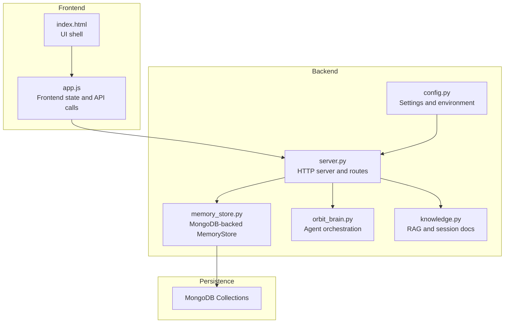
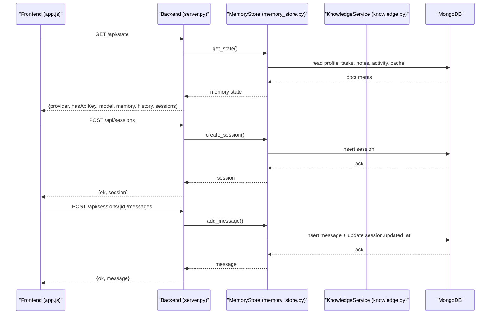
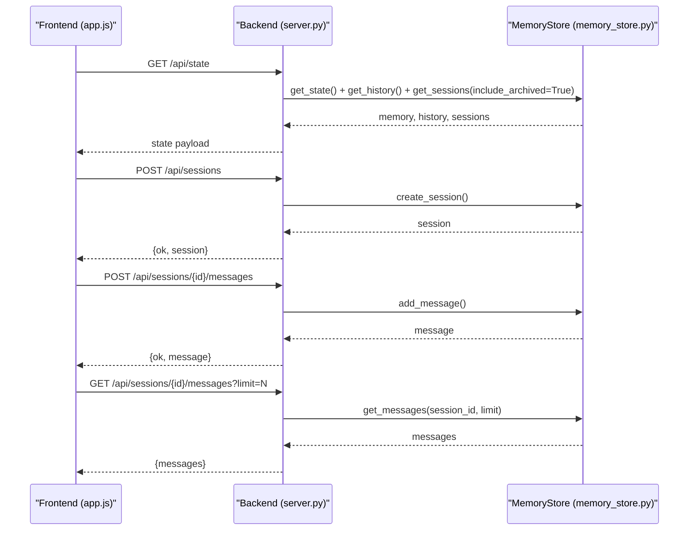
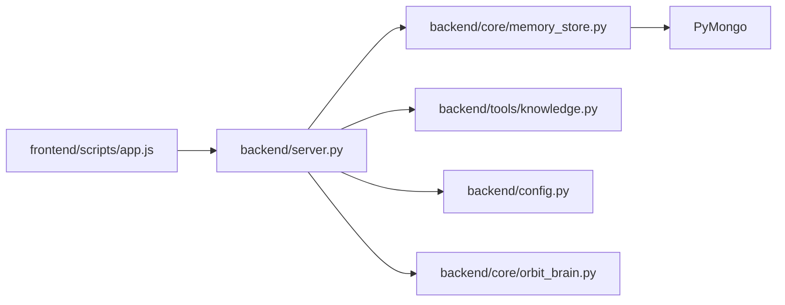
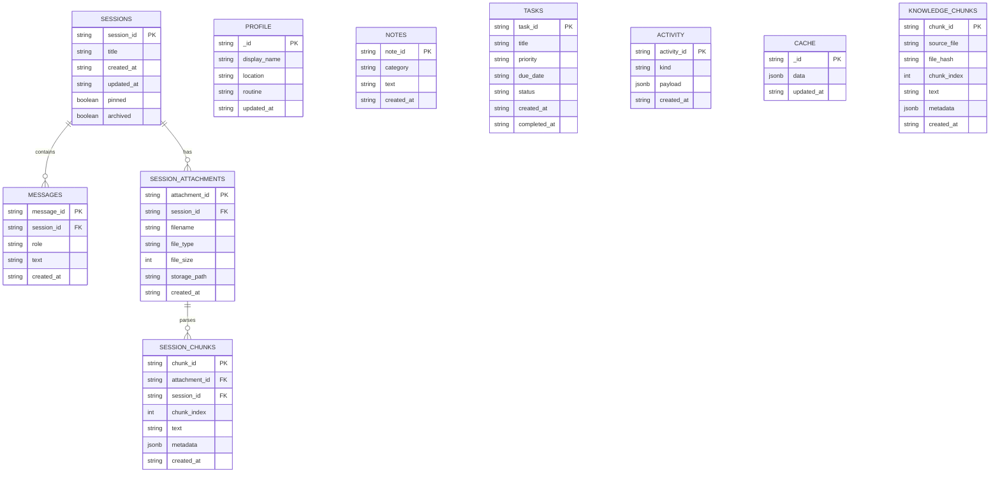

# Memory Management

<cite>
**Referenced Files in This Document**
- [memory_store.py](file://backend/core/memory_store.py)
- [server.py](file://backend/server.py)
- [config.py](file://backend/config.py)
- [orbit_brain.py](file://backend/core/orbit_brain.py)
- [knowledge.py](file://backend/tools/knowledge.py)
- [app.js](file://frontend/scripts/app.js)
- [index.html](file://frontend/index.html)
- [assistant_memory.json.bak](file://data/assistant_memory.json.bak)
</cite>

## Table of Contents
1. [Introduction](#introduction)
2. [Project Structure](#project-structure)
3. [Core Components](#core-components)
4. [Architecture Overview](#architecture-overview)
5. [Detailed Component Analysis](#detailed-component-analysis)
6. [Dependency Analysis](#dependency-analysis)
7. [Performance Considerations](#performance-considerations)
8. [Troubleshooting Guide](#troubleshooting-guide)
9. [Conclusion](#conclusion)
10. [Appendices](#appendices)

## Introduction
This document explains the memory management system that powers the Orbit Virtual Assistant. It focuses on the MongoDB-backed persistence layer implemented by the MemoryStore class, covering session management, message storage, task management, user profile persistence, and the migration from legacy JSON files. It also details the repository pattern implementation for unified data access, query optimization strategies, data consistency mechanisms, memory state tracking, event propagation, and integration with the frontend state management.

## Project Structure
The memory management system spans backend services, a MongoDB-backed persistence layer, and a frontend that consumes the backend APIs to manage and visualize memory state.

**Diagram sources**
- [server.py:23-83](file://backend/server.py#L23-L83)
- [memory_store.py:67-117](file://backend/core/memory_store.py#L67-L117)
- [config.py:20-76](file://backend/config.py#L20-L76)
- [orbit_brain.py:9-9](file://backend/core/orbit_brain.py#L9-L9)
- [knowledge.py:88-140](file://backend/tools/knowledge.py#L88-L140)

**Section sources**
- [server.py:23-83](file://backend/server.py#L23-L83)
- [memory_store.py:67-117](file://backend/core/memory_store.py#L67-L117)
- [config.py:20-76](file://backend/config.py#L20-L76)

## Core Components
- MemoryStore: MongoDB-backed persistence layer providing a unified repository interface for profiles, notes, tasks, weather/news cache, chat history, sessions, messages, knowledge chunks, and attachments/chunks. It ensures thread-safe access via a lock and maintains backward compatibility with the legacy JSON API surface.
- AssistantApplication: HTTP server that orchestrates MemoryStore, KnowledgeService, and the LLM assistant, exposing REST endpoints for state, sessions, messages, attachments, and tool integrations.
- KnowledgeService: Handles persistent knowledge indexing and session-scoped document search, integrating with MongoDB for chunk storage and retrieval.
- Frontend app.js: Consumes the backend APIs to manage sessions, messages, attachments, tasks, notes, and profile updates, maintaining a reactive UI state synchronized with the backend.

**Section sources**
- [memory_store.py:67-117](file://backend/core/memory_store.py#L67-L117)
- [server.py:23-83](file://backend/server.py#L23-L83)
- [knowledge.py:88-140](file://backend/tools/knowledge.py#L88-L140)
- [app.js:902-926](file://frontend/scripts/app.js#L902-L926)

## Architecture Overview
The system follows a layered architecture:
- Presentation: Frontend renders UI and invokes REST endpoints.
- Application: Backend server routes requests to MemoryStore, KnowledgeService, and the LLM assistant.
- Persistence: MemoryStore manages MongoDB collections and indexes, ensuring data consistency and performance.
- Integration: Legacy JSON migration enables seamless transition from file-based to database-backed memory.

**Diagram sources**
- [server.py:106-167](file://backend/server.py#L106-L167)
- [server.py:183-213](file://backend/server.py#L183-L213)
- [memory_store.py:579-596](file://backend/core/memory_store.py#L579-L596)
- [memory_store.py:652-673](file://backend/core/memory_store.py#L652-L673)

## Detailed Component Analysis

### MemoryStore: MongoDB-backed Persistence Layer
MemoryStore encapsulates the repository pattern for unified data access against MongoDB. It maintains thread safety with a lock, enforces indexes for performance, and preserves backward compatibility by mirroring the legacy JSON API surface.

Key responsibilities:
- Session management: create, list, update, delete sessions with pinned/archived flags and timestamps.
- Message management: append messages to sessions with role/text and timestamps; query messages with limits.
- Task management: add, complete, delete tasks with status tracking.
- Notes management: add and delete notes with categories.
- Profile persistence: update user profile fields and timestamps.
- Weather/news cache: store last fetched data keyed by document IDs.
- Activity logging: record user/system events with capped retention.
- Knowledge chunks: persist and retrieve RAG chunks for knowledge base and session docs.
- Attachments and chunks: manage file attachments and parsed chunks per session.

Indexes and constraints:
- Unique indexes on IDs for tasks, notes, messages, sessions, cache keys, knowledge chunks, session attachments, and session chunks.
- Compound indexes for efficient sorting and filtering (e.g., sessions by pinned and updated_at, messages by session_id and created_at, activity by created_at).

Thread safety:
- All write operations are guarded by a lock to prevent race conditions.

Activity management:
- Automatic insertion of activity records with capped size trimming to maintain performance and storage limits.

Backward compatibility:
- Methods mirror legacy JSON API shapes to minimize changes in consumers like orbit_brain.py and server.py.

**Section sources**
- [memory_store.py:67-117](file://backend/core/memory_store.py#L67-L117)
- [memory_store.py:119-135](file://backend/core/memory_store.py#L119-L135)
- [memory_store.py:162-183](file://backend/core/memory_store.py#L162-L183)
- [memory_store.py:188-250](file://backend/core/memory_store.py#L188-L250)
- [memory_store.py:282-303](file://backend/core/memory_store.py#L282-L303)
- [memory_store.py:309-332](file://backend/core/memory_store.py#L309-L332)
- [memory_store.py:338-446](file://backend/core/memory_store.py#L338-L446)
- [memory_store.py:475-495](file://backend/core/memory_store.py#L475-L495)
- [memory_store.py:501-573](file://backend/core/memory_store.py#L501-L573)
- [memory_store.py:579-646](file://backend/core/memory_store.py#L579-L646)
- [memory_store.py:652-690](file://backend/core/memory_store.py#L652-L690)
- [memory_store.py:695-748](file://backend/core/memory_store.py#L695-L748)
- [memory_store.py:754-796](file://backend/core/memory_store.py#L754-L796)
- [memory_store.py:802-830](file://backend/core/memory_store.py#L802-L830)

### Data Migration: From Legacy JSON to MongoDB
The system supports automatic migration from legacy JSON files to MongoDB to preserve user data and avoid downtime.

Migration process:
- Detect presence of legacy JSON and chat history files.
- Instantiate MemoryStore and import profile, notes, tasks, activity, and cached weather/news.
- Import chat history into the messages collection under a default session if needed.
- Rename legacy files to .bak to prevent repeated migration runs.

Schema transformation:
- Legacy JSON fields are mapped to MongoDB document fields aligned with the schema reference in the code comments.
- Duplicate entries are safely skipped using unique IDs.

Backward compatibility:
- After migration, the backend continues to serve the same JSON-like state shape to clients.

**Section sources**
- [server.py:27-48](file://backend/server.py#L27-L48)
- [memory_store.py:836-946](file://backend/core/memory_store.py#L836-L946)
- [assistant_memory.json.bak:1-279](file://data/assistant_memory.json.bak#L1-L279)

### Repository Pattern Implementation
MemoryStore implements a repository pattern:
- Unified interface for CRUD operations across multiple domains (sessions, messages, tasks, notes, profile, cache, knowledge chunks, attachments, chunks).
- Encapsulation of MongoDB specifics behind a stable API, enabling easy switching to other stores if needed.
- Consistent error handling and validation (e.g., empty text checks, ID existence checks).

Consistency mechanisms:
- Single-threaded writes via lock to prevent interleaving.
- Atomic operations where possible (e.g., upserts for cache, find-and-update for sessions).
- Capped activity collection to bound growth.

**Section sources**
- [memory_store.py:67-117](file://backend/core/memory_store.py#L67-L117)
- [memory_store.py:162-183](file://backend/core/memory_store.py#L162-L183)

### Query Optimization Strategies
- Indexes: Unique and compound indexes optimize frequent queries (IDs, session filters, timestamps).
- Sorting and limiting: Queries for messages and sessions use explicit sort orders and limits to reduce result sets.
- Aggregation: Knowledge chunk retrieval uses aggregation to group by source file and hash for change detection.
- Caching: Activity logs are capped to control memory usage.

**Section sources**
- [memory_store.py:119-135](file://backend/core/memory_store.py#L119-L135)
- [memory_store.py:675-685](file://backend/core/memory_store.py#L675-L685)
- [memory_store.py:695-702](file://backend/core/memory_store.py#L695-L702)

### Data Consistency and Event Propagation
- Activity logging: Every significant operation inserts an activity record with a unique ID and timestamp, then trims the collection to a fixed size.
- Timestamps: Updated-at fields are maintained on sessions and profile to reflect recency.
- Locking: Write operations are serialized to avoid inconsistent reads.

**Section sources**
- [memory_store.py:162-183](file://backend/core/memory_store.py#L162-L183)
- [memory_store.py:551-554](file://backend/core/memory_store.py#L551-L554)
- [memory_store.py:296-303](file://backend/core/memory_store.py#L296-L303)

### Integration with Frontend State Management
The frontend consumes the backend APIs to manage and visualize memory state:
- State synchronization: GET /api/state returns memory, history, and sessions for initialization.
- Session lifecycle: Create, list, load, pin/archive, and delete sessions; load messages per session.
- Message lifecycle: Append user and assistant messages to the active session.
- Attachments: Upload files, parse and index for session-scoped search, and manage deletions.
- Tools: Profile updates, task management, note management, weather/news refresh.

**Diagram sources**
- [server.py:106-167](file://backend/server.py#L106-L167)
- [server.py:183-213](file://backend/server.py#L183-L213)
- [memory_store.py:579-596](file://backend/core/memory_store.py#L579-L596)
- [memory_store.py:652-673](file://backend/core/memory_store.py#L652-L673)
- [memory_store.py:675-685](file://backend/core/memory_store.py#L675-L685)

**Section sources**
- [app.js:902-926](file://frontend/scripts/app.js#L902-L926)
- [app.js:964-978](file://frontend/scripts/app.js#L964-L978)
- [app.js:983-989](file://frontend/scripts/app.js#L983-L989)
- [app.js:1038-1045](file://frontend/scripts/app.js#L1038-L1045)
- [app.js:1226-1237](file://frontend/scripts/app.js#L1226-L1237)

### Practical Examples

#### CRUD Operations
- Create a session:
  - Endpoint: POST /api/sessions
  - Payload: { title }
  - Response: { ok, session }
- Add a message to a session:
  - Endpoint: POST /api/sessions/{id}/messages
  - Payload: { role, text }
  - Response: { ok, message }
- Complete a task:
  - Endpoint: POST /api/tasks/complete
  - Payload: { taskRef }
  - Response: { ok, task, memory }
- Delete a note:
  - Endpoint: DELETE /api/notes/{id}
  - Response: { ok, memory }

#### Data Querying Patterns
- List sessions with archived included:
  - Endpoint: GET /api/sessions?include_archived=true
  - Response: { sessions }
- Get messages for a session with a limit:
  - Endpoint: GET /api/sessions/{id}/messages?limit=N
  - Response: { messages }

#### Performance Optimization Techniques
- Use indexes on frequently queried fields (session_id, created_at, task_id, note_id).
- Limit result sets with query limits for message retrieval.
- Maintain capped activity logs to control growth.
- Use aggregation for knowledge chunk grouping and hashing.

**Section sources**
- [server.py:111-167](file://backend/server.py#L111-L167)
- [server.py:183-266](file://backend/server.py#L183-L266)
- [memory_store.py:119-135](file://backend/core/memory_store.py#L119-L135)
- [memory_store.py:675-685](file://backend/core/memory_store.py#L675-L685)

## Dependency Analysis
MemoryStore depends on MongoDB for persistence and uses PyMongo for database operations. The server composes MemoryStore, KnowledgeService, and the LLM assistant. The frontend depends on the backend REST endpoints.

**Diagram sources**
- [server.py:14-21](file://backend/server.py#L14-L21)
- [memory_store.py:11-14](file://backend/core/memory_store.py#L11-L14)
- [config.py:14-21](file://backend/config.py#L14-L21)
- [orbit_brain.py:9-9](file://backend/core/orbit_brain.py#L9-L9)
- [knowledge.py:12-24](file://backend/tools/knowledge.py#L12-L24)

**Section sources**
- [server.py:14-21](file://backend/server.py#L14-L21)
- [memory_store.py:11-14](file://backend/core/memory_store.py#L11-L14)
- [config.py:14-21](file://backend/config.py#L14-L21)

## Performance Considerations
- Indexing: Ensure unique and compound indexes are created on ID fields and frequently sorted fields.
- Query limits: Apply limits to message retrieval to avoid large result sets.
- Capped collections: Maintain activity logs with a fixed size to control memory usage.
- Locking: Serialize write operations to prevent contention and ensure consistency.
- Embedding availability: When LM Studio embeddings are available, hybrid retrievers improve search quality; otherwise, BM25-only retrievers are used.

[No sources needed since this section provides general guidance]

## Troubleshooting Guide
Common issues and resolutions:
- MongoDB connection failures: Verify URI and DB name in settings; ensure the MongoDB server is running.
- Empty payloads: The legacy history update guard prevents overwriting with empty arrays; ensure payloads are non-empty.
- Missing IDs: Many operations require valid IDs; confirm IDs exist before invoking delete/update operations.
- File upload errors: Validate file types and sizes; ensure the upload directory exists and is writable.
- Activity trimming: If activity appears truncated, confirm the capped size and trimming logic.

**Section sources**
- [config.py:35-36](file://backend/config.py#L35-L36)
- [server.py:33-43](file://backend/server.py#L33-L43)
- [memory_store.py:512-514](file://backend/core/memory_store.py#L512-L514)
- [server.py:326-361](file://backend/server.py#L326-L361)

## Conclusion
The memory management system provides a robust, backward-compatible, and scalable persistence layer powered by MongoDB. Through the MemoryStore repository, it unifies access to sessions, messages, tasks, notes, profile, cache, and knowledge chunks. The server exposes a cohesive REST API consumed by the frontend, enabling rich state management and integration with RAG capabilities. Migration from legacy JSON ensures continuity, while indexing, locking, and capped collections maintain performance and reliability.

## Appendices

### Data Model Overview

**Diagram sources**
- [memory_store.py:24-62](file://backend/core/memory_store.py#L24-L62)