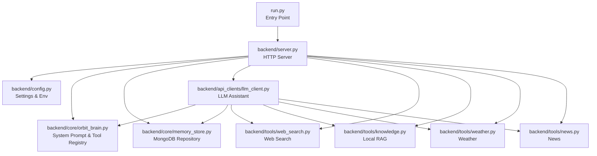
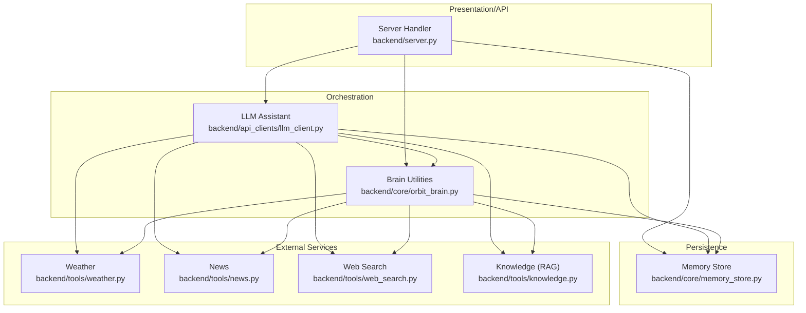
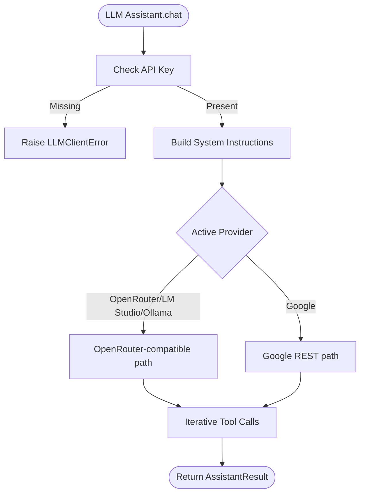
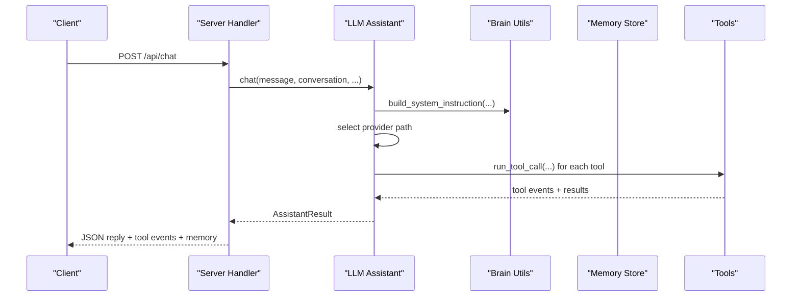
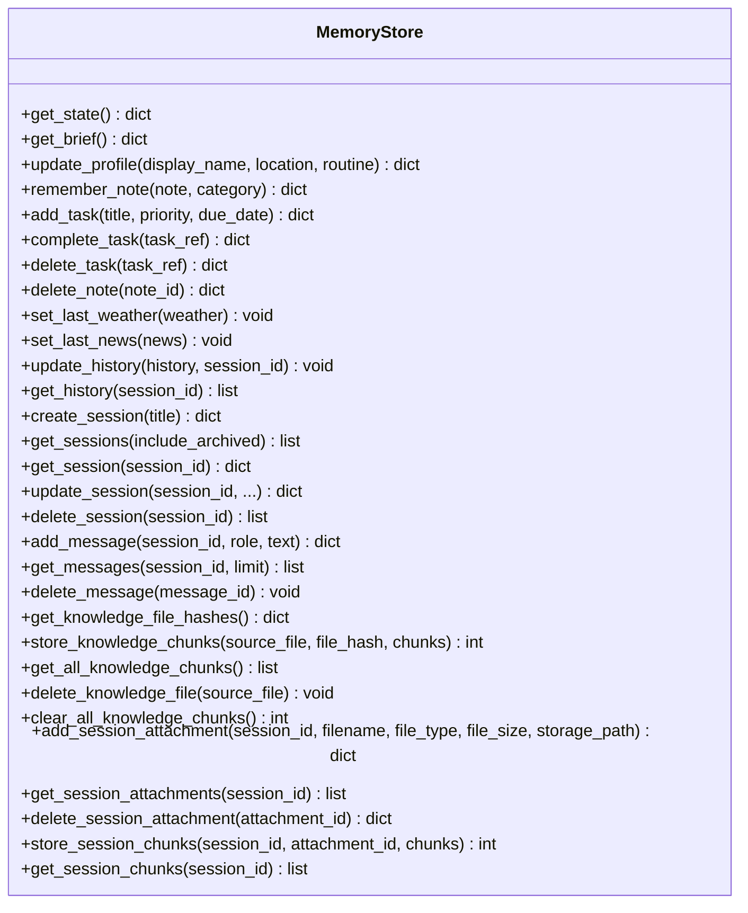
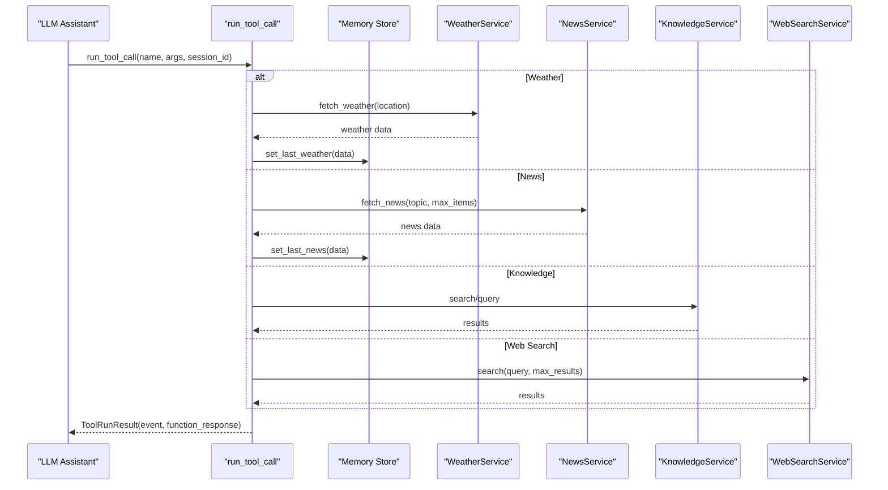
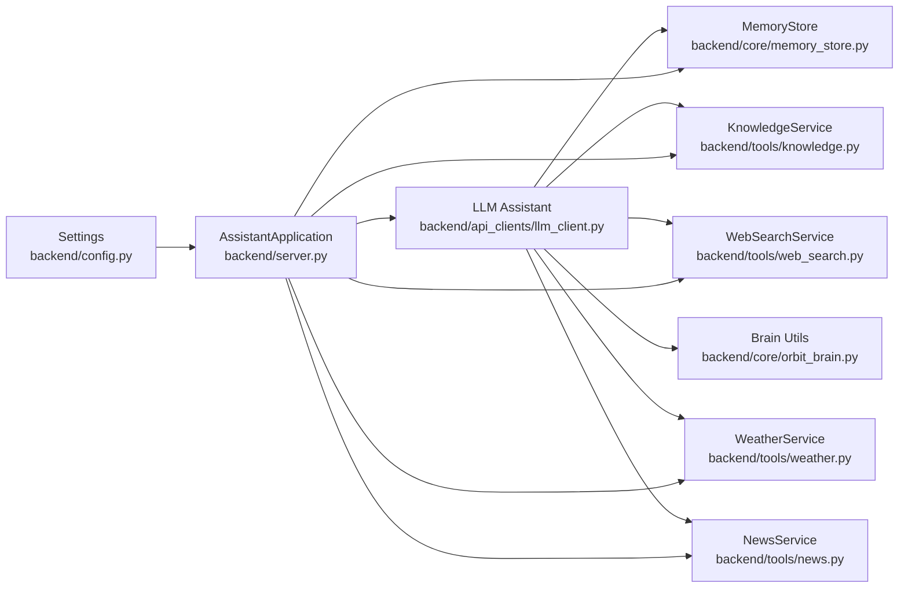
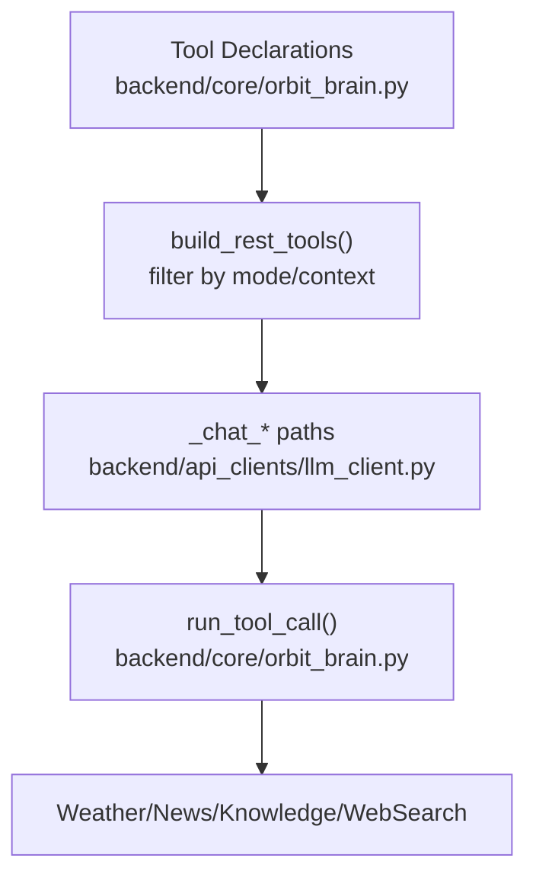
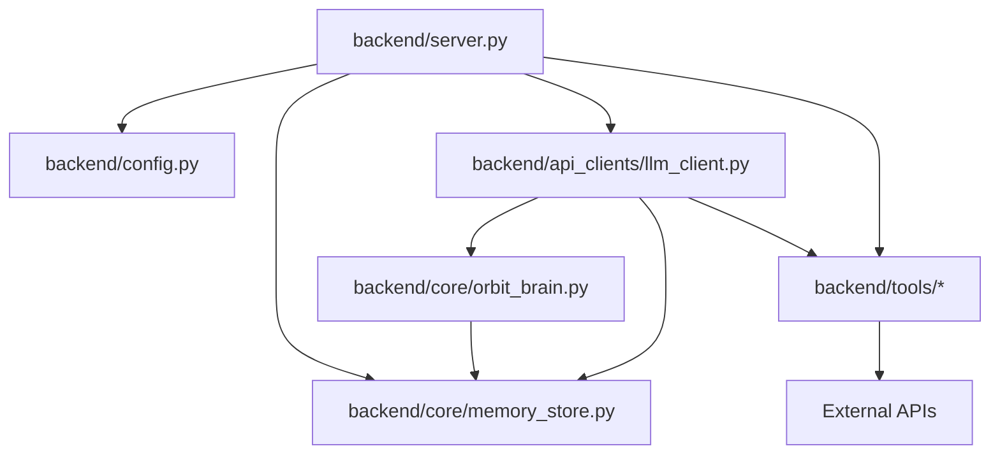

# Component Integration Patterns

<cite>
**Referenced Files in This Document**
- [README.md](file://README.md)
- [run.py](file://run.py)
- [backend/config.py](file://backend/config.py)
- [backend/server.py](file://backend/server.py)
- [backend/api_clients/llm_client.py](file://backend/api_clients/llm_client.py)
- [backend/api_clients/gemini_client.py](file://backend/api_clients/gemini_client.py)
- [backend/core/orbit_brain.py](file://backend/core/orbit_brain.py)
- [backend/core/memory_store.py](file://backend/core/memory_store.py)
- [backend/tools/knowledge.py](file://backend/tools/knowledge.py)
- [backend/tools/weather.py](file://backend/tools/weather.py)
- [backend/tools/news.py](file://backend/tools/news.py)
- [backend/tools/web_search.py](file://backend/tools/web_search.py)
- [backend/audio/asr_whisper.py](file://backend/audio/asr_whisper.py)
</cite>

## Table of Contents
1. [Introduction](#introduction)
2. [Project Structure](#project-structure)
3. [Core Components](#core-components)
4. [Architecture Overview](#architecture-overview)
5. [Detailed Component Analysis](#detailed-component-analysis)
6. [Dependency Analysis](#dependency-analysis)
7. [Performance Considerations](#performance-considerations)
8. [Troubleshooting Guide](#troubleshooting-guide)
9. [Conclusion](#conclusion)
10. [Appendices](#appendices)

## Introduction
This document explains the architectural patterns and design principles implemented in the Orbit Virtual Assistant backend. It focuses on:
- Strategy pattern for pluggable AI providers
- Factory-like dynamic LLM client selection
- Repository pattern for unified data access
- Observer-like memory state tracking and event propagation
- Dependency injection and service composition
- Plugin-style tool registration and extension points
- Cross-cutting concerns: error handling, logging, and monitoring

The goal is to help developers understand how components integrate, how to extend functionality, and how to reason about runtime behavior across providers, tools, and persistence layers.

## Project Structure
The backend is organized into cohesive layers:
- Configuration and entry point
- HTTP server and API orchestration
- LLM clients and provider abstraction
- Core brain logic and memory repository
- Tools for external services (weather, news, web search, knowledge)
- Audio processing placeholder

**Diagram sources**
- [run.py:1-6](file://run.py#L1-L6)
- [backend/server.py:23-611](file://backend/server.py#L23-L611)
- [backend/config.py:55-76](file://backend/config.py#L55-L76)
- [backend/api_clients/llm_client.py:38-366](file://backend/api_clients/llm_client.py#L38-L366)
- [backend/core/orbit_brain.py:302-502](file://backend/core/orbit_brain.py#L302-L502)
- [backend/core/memory_store.py:67-947](file://backend/core/memory_store.py#L67-L947)
- [backend/tools/web_search.py:53-139](file://backend/tools/web_search.py#L53-L139)
- [backend/tools/knowledge.py:88-393](file://backend/tools/knowledge.py#L88-L393)
- [backend/tools/weather.py:48-141](file://backend/tools/weather.py#L48-L141)
- [backend/tools/news.py:22-83](file://backend/tools/news.py#L22-L83)

**Section sources**
- [README.md:164-201](file://README.md#L164-L201)
- [run.py:1-6](file://run.py#L1-L6)
- [backend/server.py:23-611](file://backend/server.py#L23-L611)

## Core Components
- Settings and configuration: centralized provider selection, API keys, ports, and feature toggles
- HTTP server: orchestrates endpoints, instantiates services, and routes requests
- LLM Assistant: provider-agnostic chat orchestration with tool invocation
- Brain: system prompts, tool declarations, and tool dispatch
- Memory Store: MongoDB-backed repository for sessions, messages, profile, tasks, notes, and caches
- Tools: weather, news, web search, and knowledge (RAG) services
- Audio: placeholder for ASR integration

Key integration points:
- Provider switching is driven by settings and reflected in LLM client logic
- Tool registry and dispatch are centralized in the brain module
- Memory store acts as a single source of truth for state and history
- Tools are injected into the LLM assistant and brain to enable dynamic capabilities

**Section sources**
- [backend/config.py:20-76](file://backend/config.py#L20-L76)
- [backend/server.py:23-611](file://backend/server.py#L23-L611)
- [backend/api_clients/llm_client.py:38-366](file://backend/api_clients/llm_client.py#L38-L366)
- [backend/core/orbit_brain.py:302-502](file://backend/core/orbit_brain.py#L302-L502)
- [backend/core/memory_store.py:67-947](file://backend/core/memory_store.py#L67-L947)
- [backend/tools/knowledge.py:88-393](file://backend/tools/knowledge.py#L88-L393)
- [backend/tools/weather.py:48-141](file://backend/tools/weather.py#L48-L141)
- [backend/tools/news.py:22-83](file://backend/tools/news.py#L22-L83)
- [backend/tools/web_search.py:53-139](file://backend/tools/web_search.py#L53-L139)

## Architecture Overview
The system follows a layered architecture with explicit separation of concerns:
- Presentation and API: HTTP server exposes endpoints and serves static assets
- Orchestration: server composes services and delegates to LLM assistant
- Intelligence: brain builds prompts and tool declarations; assistant executes provider-specific logic
- Persistence: memory store encapsulates MongoDB collections behind a unified interface
- Tools: external services are abstracted behind simple interfaces and integrated via tool calls

**Diagram sources**
- [backend/server.py:23-611](file://backend/server.py#L23-L611)
- [backend/api_clients/llm_client.py:38-366](file://backend/api_clients/llm_client.py#L38-L366)
- [backend/core/orbit_brain.py:302-502](file://backend/core/orbit_brain.py#L302-L502)
- [backend/core/memory_store.py:67-947](file://backend/core/memory_store.py#L67-L947)
- [backend/tools/weather.py:48-141](file://backend/tools/weather.py#L48-L141)
- [backend/tools/news.py:22-83](file://backend/tools/news.py#L22-L83)
- [backend/tools/web_search.py:53-139](file://backend/tools/web_search.py#L53-L139)
- [backend/tools/knowledge.py:88-393](file://backend/tools/knowledge.py#L88-L393)

## Detailed Component Analysis

### Strategy Pattern: Pluggable AI Providers
The system implements a strategy-like pattern to select and configure LLM providers at runtime:
- Provider selection is controlled by settings (active provider, model, API keys)
- The LLM assistant branches on provider to call the appropriate endpoint and payload construction
- OpenRouter-compatible providers (OpenRouter, LM Studio, Ollama) share a common path; Google Gemini uses a separate REST path

**Diagram sources**
- [backend/api_clients/llm_client.py:47-78](file://backend/api_clients/llm_client.py#L47-L78)
- [backend/api_clients/llm_client.py:82-216](file://backend/api_clients/llm_client.py#L82-L216)
- [backend/api_clients/llm_client.py:220-273](file://backend/api_clients/llm_client.py#L220-L273)
- [backend/config.py:38-53](file://backend/config.py#L38-L53)

**Section sources**
- [backend/config.py:20-76](file://backend/config.py#L20-L76)
- [backend/api_clients/llm_client.py:38-366](file://backend/api_clients/llm_client.py#L38-L366)

### Factory Pattern: Dynamic LLM Client Selection
While not a traditional factory, the server composes services and passes settings-derived configuration to the LLM assistant. The assistant internally selects provider logic based on settings, effectively acting as a factory for provider-specific chat flows.

**Diagram sources**
- [backend/server.py:276-321](file://backend/server.py#L276-L321)
- [backend/api_clients/llm_client.py:38-366](file://backend/api_clients/llm_client.py#L38-L366)
- [backend/core/orbit_brain.py:302-502](file://backend/core/orbit_brain.py#L302-L502)

**Section sources**
- [backend/server.py:23-611](file://backend/server.py#L23-L611)
- [backend/api_clients/llm_client.py:38-366](file://backend/api_clients/llm_client.py#L38-L366)

### Repository Pattern: Unified Data Access
The memory store encapsulates MongoDB collections behind a consistent interface:
- Sessions, messages, profile, notes, tasks, activity cache, knowledge chunks, attachments, and session chunks
- Thread-safe operations with locking around write paths
- Index management and initialization for performance and correctness
- Migration from legacy JSON to MongoDB

**Diagram sources**
- [backend/core/memory_store.py:67-947](file://backend/core/memory_store.py#L67-L947)

**Section sources**
- [backend/core/memory_store.py:67-947](file://backend/core/memory_store.py#L67-L947)

### Observer Pattern: Memory State Tracking and Event Propagation
The brain’s tool dispatcher emits structured events for each tool call. These events are collected and returned alongside the assistant’s reply, enabling UI and logging to track tool usage and outcomes.

**Diagram sources**
- [backend/core/orbit_brain.py:389-502](file://backend/core/orbit_brain.py#L389-L502)
- [backend/tools/weather.py:51-75](file://backend/tools/weather.py#L51-L75)
- [backend/tools/news.py:25-60](file://backend/tools/news.py#L25-L60)
- [backend/tools/knowledge.py:270-298](file://backend/tools/knowledge.py#L270-L298)
- [backend/tools/web_search.py:69-104](file://backend/tools/web_search.py#L69-L104)

**Section sources**
- [backend/core/orbit_brain.py:389-502](file://backend/core/orbit_brain.py#L389-L502)

### Dependency Injection and Service Composition
Services are composed in the server application and passed to the LLM assistant:
- Memory store, knowledge service, web search service, and weather/news services are injected into the assistant
- The brain receives memory store and tool services to execute tool calls
- Settings drive provider selection and model configuration

**Diagram sources**
- [backend/server.py:23-63](file://backend/server.py#L23-L63)
- [backend/api_clients/llm_client.py:38-46](file://backend/api_clients/llm_client.py#L38-L46)
- [backend/core/orbit_brain.py:389-400](file://backend/core/orbit_brain.py#L389-L400)

**Section sources**
- [backend/server.py:23-63](file://backend/server.py#L23-L63)
- [backend/api_clients/llm_client.py:38-46](file://backend/api_clients/llm_client.py#L38-L46)
- [backend/core/orbit_brain.py:389-400](file://backend/core/orbit_brain.py#L389-L400)

### Plugin Architecture: Tool Registration and Extension
The brain defines a fixed set of tool declarations and a dispatcher that routes tool calls to services. This creates a plugin-like extension surface:
- New tools can be added by extending the function declaration list and the dispatcher switch
- Tool availability can be toggled via the brain’s tool builder based on mode and context (e.g., offline, session docs presence)

**Diagram sources**
- [backend/core/orbit_brain.py:74-268](file://backend/core/orbit_brain.py#L74-L268)
- [backend/core/orbit_brain.py:361-387](file://backend/core/orbit_brain.py#L361-L387)
- [backend/core/orbit_brain.py:389-502](file://backend/core/orbit_brain.py#L389-L502)
- [backend/api_clients/llm_client.py:109-116](file://backend/api_clients/llm_client.py#L109-L116)

**Section sources**
- [backend/core/orbit_brain.py:74-268](file://backend/core/orbit_brain.py#L74-L268)
- [backend/core/orbit_brain.py:361-387](file://backend/core/orbit_brain.py#L361-L387)
- [backend/core/orbit_brain.py:389-502](file://backend/core/orbit_brain.py#L389-L502)

### Integration Examples

- How tools are registered:
  - Tool declarations are defined centrally and filtered by mode and context
  - The assistant includes these tools in provider requests

- How providers are switched dynamically:
  - At startup, the user selects a provider and model; settings are updated accordingly
  - The LLM assistant selects the appropriate provider path based on settings

- How external services are abstracted:
  - Weather, news, web search, and knowledge services expose simple interfaces
  - The brain’s dispatcher invokes these services and records events

**Section sources**
- [backend/server.py:566-611](file://backend/server.py#L566-L611)
- [backend/api_clients/llm_client.py:74-77](file://backend/api_clients/llm_client.py#L74-L77)
- [backend/core/orbit_brain.py:361-387](file://backend/core/orbit_brain.py#L361-L387)

## Dependency Analysis
The system exhibits low coupling and high cohesion:
- Server depends on configuration, memory store, and LLM assistant
- LLM assistant depends on brain utilities, memory store, and tools
- Tools depend on external APIs and are isolated behind simple interfaces
- Memory store encapsulates MongoDB specifics behind a repository interface

**Diagram sources**
- [backend/server.py:14-21](file://backend/server.py#L14-L21)
- [backend/api_clients/llm_client.py:11-21](file://backend/api_clients/llm_client.py#L11-L21)
- [backend/core/orbit_brain.py:9-12](file://backend/core/orbit_brain.py#L9-L12)

**Section sources**
- [backend/server.py:14-21](file://backend/server.py#L14-L21)
- [backend/api_clients/llm_client.py:11-21](file://backend/api_clients/llm_client.py#L11-L21)
- [backend/core/orbit_brain.py:9-12](file://backend/core/orbit_brain.py#L9-L12)

## Performance Considerations
- MongoDB indexing: indexes are created for frequent queries (sessions, messages, attachments, chunks)
- Threading locks: memory store uses locks around write operations to prevent race conditions
- Tool loop limits: the assistant enforces a maximum iteration count to avoid infinite tool loops
- Embedding connectivity: knowledge service attempts to connect to LM Studio embeddings and falls back if unavailable
- Search timeouts: external services enforce timeouts to avoid hanging requests

[No sources needed since this section provides general guidance]

## Troubleshooting Guide
Common issues and resolutions:
- Missing API keys: the assistant raises a specific error when the active provider key is missing
- Provider unavailability: HTTP/URL errors are caught and surfaced as LLM client errors
- Tool failures: tool dispatcher wraps exceptions and returns structured error events
- MongoDB connectivity: connection failures during initialization raise runtime errors
- External service errors: weather, news, and web search services raise typed errors for invalid inputs or network issues

**Section sources**
- [backend/api_clients/llm_client.py:34-35](file://backend/api_clients/llm_client.py#L34-L35)
- [backend/api_clients/llm_client.py:60-61](file://backend/api_clients/llm_client.py#L60-L61)
- [backend/api_clients/llm_client.py:161-174](file://backend/api_clients/llm_client.py#L161-L174)
- [backend/core/memory_store.py:94-98](file://backend/core/memory_store.py#L94-L98)
- [backend/tools/weather.py:125-126](file://backend/tools/weather.py#L125-L126)
- [backend/tools/news.py:80-82](file://backend/tools/news.py#L80-L82)
- [backend/tools/web_search.py:104](file://backend/tools/web_search.py#L104)

## Conclusion
The Orbit Virtual Assistant demonstrates robust integration patterns:
- Strategy-like provider switching enables flexible deployment across multiple LLM backends
- Centralized brain utilities and tool dispatch provide a clean extension surface
- A MongoDB-backed repository abstracts persistence concerns and ensures consistency
- Structured tool events enable observability and UI feedback
- Clear error handling and timeouts improve reliability

These patterns collectively support a maintainable, extensible, and observable system that can evolve with changing provider ecosystems and user needs.

## Appendices

### Cross-Cutting Concerns
- Logging: memory store uses a logger; tools and services log warnings and errors
- Monitoring: tool events carry structured metadata for UI and analytics
- Error handling: dedicated exception types and consistent error responses across services

**Section sources**
- [backend/core/memory_store.py:16](file://backend/core/memory_store.py#L16)
- [backend/tools/knowledge.py:134-137](file://backend/tools/knowledge.py#L134-L137)
- [backend/tools/weather.py:125-126](file://backend/tools/weather.py#L125-L126)
- [backend/tools/news.py:80-82](file://backend/tools/news.py#L80-L82)
- [backend/tools/web_search.py:87-100](file://backend/tools/web_search.py#L87-L100)