# Data Flow and Processing

<cite>
**Referenced Files in This Document**
- [run.py](file://run.py)
- [backend/server.py](file://backend/server.py)
- [backend/config.py](file://backend/config.py)
- [backend/api_clients/llm_client.py](file://backend/api_clients/llm_client.py)
- [backend/core/orbit_brain.py](file://backend/core/orbit_brain.py)
- [backend/core/memory_store.py](file://backend/core/memory_store.py)
- [backend/tools/knowledge.py](file://backend/tools/knowledge.py)
- [backend/tools/web_search.py](file://backend/tools/web_search.py)
- [backend/tools/weather.py](file://backend/tools/weather.py)
- [backend/tools/news.py](file://backend/tools/news.py)
- [frontend/scripts/app.js](file://frontend/scripts/app.js)
- [README.md](file://README.md)
</cite>

## Table of Contents
1. [Introduction](#introduction)
2. [Project Structure](#project-structure)
3. [Core Components](#core-components)
4. [Architecture Overview](#architecture-overview)
5. [Detailed Component Analysis](#detailed-component-analysis)
6. [Dependency Analysis](#dependency-analysis)
7. [Performance Considerations](#performance-considerations)
8. [Troubleshooting Guide](#troubleshooting-guide)
9. [Conclusion](#conclusion)
10. [Appendices](#appendices)

## Introduction
This document explains the complete data flow patterns in the Orbit Virtual Assistant system. It traces user input from the frontend through the HTTP server, assistant application, LLM client, tool execution, and memory persistence. It also covers conversation state management, attachment processing, knowledge retrieval, transformations, validations, error propagation, session lifecycle, and performance strategies.

## Project Structure
The system is organized into a Python backend (HTTP server, LLM client, brain logic, tools, and persistence) and a vanilla JavaScript frontend. The backend exposes REST endpoints for chat, sessions, messages, attachments, and utilities. The frontend manages UI state, voice input, session switching, and sends requests to the backend.

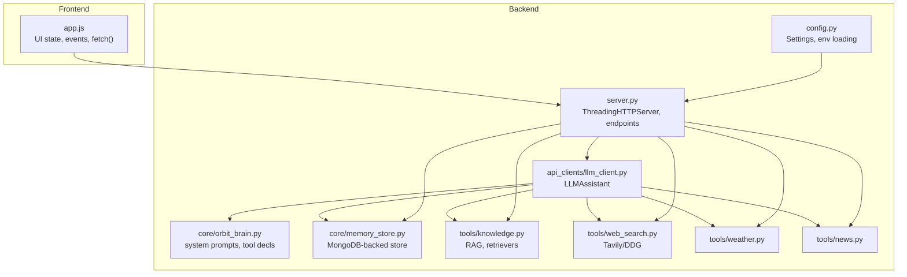

**Diagram sources**
- [backend/server.py:1-611](file://backend/server.py#L1-L611)
- [backend/api_clients/llm_client.py:1-366](file://backend/api_clients/llm_client.py#L1-L366)
- [backend/core/orbit_brain.py:1-502](file://backend/core/orbit_brain.py#L1-L502)
- [backend/core/memory_store.py:1-947](file://backend/core/memory_store.py#L1-L947)
- [backend/tools/knowledge.py:1-393](file://backend/tools/knowledge.py#L1-L393)
- [backend/tools/web_search.py:1-139](file://backend/tools/web_search.py#L1-L139)
- [backend/tools/weather.py:1-141](file://backend/tools/weather.py#L1-L141)
- [backend/tools/news.py:1-83](file://backend/tools/news.py#L1-L83)
- [backend/config.py:1-76](file://backend/config.py#L1-L76)
- [frontend/scripts/app.js:1-1765](file://frontend/scripts/app.js#L1-L1765)

**Section sources**
- [README.md:164-201](file://README.md#L164-L201)
- [backend/server.py:1-611](file://backend/server.py#L1-L611)

## Core Components
- HTTP Server and API: Provides endpoints for sessions, messages, attachments, weather, news, and chat. Handles JSON I/O, file serving, and error responses.
- Assistant Application: Orchestrates memory, tools, and LLM client; routes requests to the appropriate handler.
- LLM Client: Implements provider-specific chat flows (Google REST, OpenRouter-compatible), tool loop, and error handling.
- Brain Logic: Builds system instructions, function declarations, and executes tool calls.
- Memory Store: MongoDB-backed persistence for sessions, messages, profile, tasks, notes, cache, and knowledge chunks.
- Tools: Weather, news, web search, and knowledge (RAG) services.
- Frontend: Manages UI state, voice input, toggles, and HTTP requests.

**Section sources**
- [backend/server.py:23-63](file://backend/server.py#L23-L63)
- [backend/api_clients/llm_client.py:38-78](file://backend/api_clients/llm_client.py#L38-L78)
- [backend/core/orbit_brain.py:271-502](file://backend/core/orbit_brain.py#L271-L502)
- [backend/core/memory_store.py:67-150](file://backend/core/memory_store.py#L67-L150)
- [backend/tools/knowledge.py:88-140](file://backend/tools/knowledge.py#L88-L140)
- [backend/tools/web_search.py:53-104](file://backend/tools/web_search.py#L53-L104)
- [backend/tools/weather.py:48-75](file://backend/tools/weather.py#L48-L75)
- [backend/tools/news.py:22-60](file://backend/tools/news.py#L22-L60)
- [frontend/scripts/app.js:35-85](file://frontend/scripts/app.js#L35-L85)

## Architecture Overview
The system follows a layered architecture:
- Presentation: Static files served by the HTTP server; frontend JavaScript manages UI and user interactions.
- API Layer: REST endpoints for chat, sessions, messages, attachments, and utilities.
- Business Logic: AssistantApplication coordinates tool selection and execution.
- LLM Integration: Provider-agnostic chat orchestration with tool loop.
- Persistence: MongoDB for all conversation and memory data.
- External Services: Weather, news, web search, and optional local RAG.

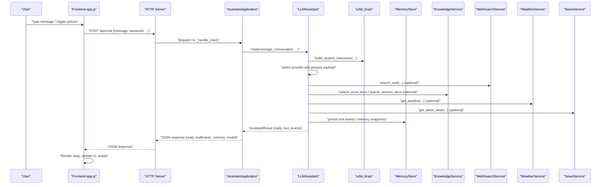

**Diagram sources**
- [backend/server.py:276-321](file://backend/server.py#L276-L321)
- [backend/api_clients/llm_client.py:47-78](file://backend/api_clients/llm_client.py#L47-L78)
- [backend/core/orbit_brain.py:302-386](file://backend/core/orbit_brain.py#L302-L386)
- [backend/tools/web_search.py:69-104](file://backend/tools/web_search.py#L69-L104)
- [backend/tools/knowledge.py:270-298](file://backend/tools/knowledge.py#L270-L298)
- [backend/tools/weather.py:51-75](file://backend/tools/weather.py#L51-L75)
- [backend/tools/news.py:25-60](file://backend/tools/news.py#L25-L60)
- [backend/core/memory_store.py:188-250](file://backend/core/memory_store.py#L188-L250)

## Detailed Component Analysis

### HTTP Server and API Endpoints
- GET endpoints serve static files and state, sessions, messages, attachments, and utilities (weather, news).
- POST endpoints handle chat, session creation, message insertion, attachment uploads, profile updates, tasks, notes, and history updates.
- PUT/DELETE endpoints manage session updates, message deletions, and attachment/session cleanup.
- JSON parsing and validation occur at the server boundary; errors are returned with appropriate HTTP status codes.

```mermaid
flowchart TD
Start(["Incoming Request"]) --> Route["Route by path and method"]
Route --> GET_State["GET /api/state"]
Route --> GET_Sessions["GET /api/sessions"]
Route --> GET_Session["GET /api/sessions/:id"]
Route --> GET_Messages["GET /api/sessions/:id/messages"]
Route --> GET_Attachments["GET /api/sessions/:id/attachments"]
Route --> GET_Weather["GET /api/weather"]
Route --> GET_News["GET /api/news"]
Route --> POST_Chat["POST /api/chat"]
Route --> POST_Sessions["POST /api/sessions"]
Route --> POST_Messages["POST /api/sessions/:id/messages"]
Route --> POST_Attachments["POST /api/sessions/:id/attachments"]
Route --> POST_Profile["POST /api/profile"]
Route --> POST_Tasks["POST /api/tasks"]
Route --> POST_Notes["POST /api/notes"]
Route --> POST_History["POST /api/history"]
Route --> PUT_Session["PUT /api/sessions/:id"]
Route --> DELETE_Session["DELETE /api/sessions/:id"]
Route --> DELETE_Message["DELETE /api/messages/:id"]
Route --> DELETE_Attachment["DELETE /api/sessions/:id/attachments/:id"]
Route --> DELETE_Note["DELETE /api/notes/:id"]
GET_* --> Handler["Handler returns JSON"]
POST_* --> Handler
PUT_* --> Handler
DELETE_* --> Handler
Handler --> End(["Response Sent"])
```

**Diagram sources**
- [backend/server.py:85-500](file://backend/server.py#L85-L500)

**Section sources**
- [backend/server.py:85-500](file://backend/server.py#L85-L500)

### Assistant Application Orchestration
- Initializes MemoryStore (MongoDB), KnowledgeService (RAG), WebSearchService, LLMAssistant, WeatherService, and NewsService.
- Provides request handlers for GET/POST/PUT/DELETE.
- Validates payloads, enforces constraints (e.g., non-empty messages), and returns structured JSON responses.
- Manages graceful fallbacks for unsupported features.

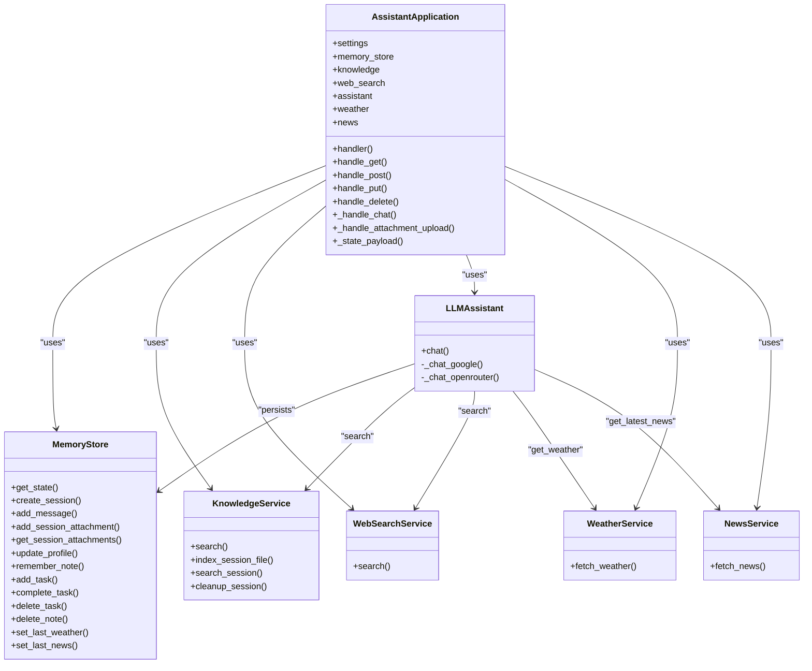

**Diagram sources**
- [backend/server.py:23-63](file://backend/server.py#L23-L63)
- [backend/core/memory_store.py:67-150](file://backend/core/memory_store.py#L67-L150)
- [backend/tools/knowledge.py:88-140](file://backend/tools/knowledge.py#L88-L140)
- [backend/tools/web_search.py:53-104](file://backend/tools/web_search.py#L53-L104)
- [backend/api_clients/llm_client.py:38-78](file://backend/api_clients/llm_client.py#L38-L78)
- [backend/tools/weather.py:48-75](file://backend/tools/weather.py#L48-L75)
- [backend/tools/news.py:22-60](file://backend/tools/news.py#L22-L60)

**Section sources**
- [backend/server.py:23-63](file://backend/server.py#L23-L63)

### LLM Client and Tool Loop
- Provider selection: Google REST API or OpenRouter-compatible endpoints (including LM Studio and Ollama).
- Payload construction: system instruction, conversation snapshot, optional screen image, and function declarations.
- Tool loop: Executes tool calls returned by the LLM, persists tool events, and continues until no tool calls remain or a loop limit is reached.
- Error handling: Propagates provider errors and safety checks (e.g., moderation flags).

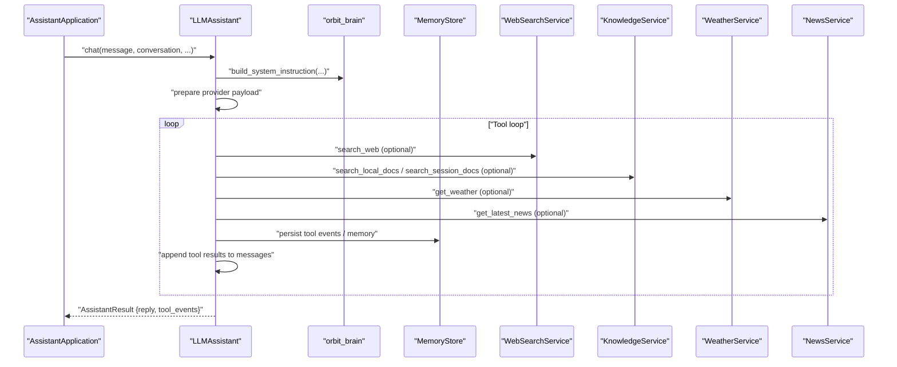

**Diagram sources**
- [backend/api_clients/llm_client.py:47-216](file://backend/api_clients/llm_client.py#L47-L216)
- [backend/core/orbit_brain.py:389-502](file://backend/core/orbit_brain.py#L389-L502)
- [backend/tools/web_search.py:69-104](file://backend/tools/web_search.py#L69-L104)
- [backend/tools/knowledge.py:270-298](file://backend/tools/knowledge.py#L270-L298)
- [backend/tools/weather.py:51-75](file://backend/tools/weather.py#L51-L75)
- [backend/tools/news.py:25-60](file://backend/tools/news.py#L25-L60)

**Section sources**
- [backend/api_clients/llm_client.py:47-216](file://backend/api_clients/llm_client.py#L47-L216)
- [backend/core/orbit_brain.py:389-502](file://backend/core/orbit_brain.py#L389-L502)

### Conversation State Management
- MemoryStore maintains a unified state with profile, tasks, notes, last weather, last news, and activity logs.
- Brief snapshot is generated for system prompts and UI rendering.
- Sessions and messages are stored per-session with timestamps and ordering.
- Activity records track user actions for auditability.

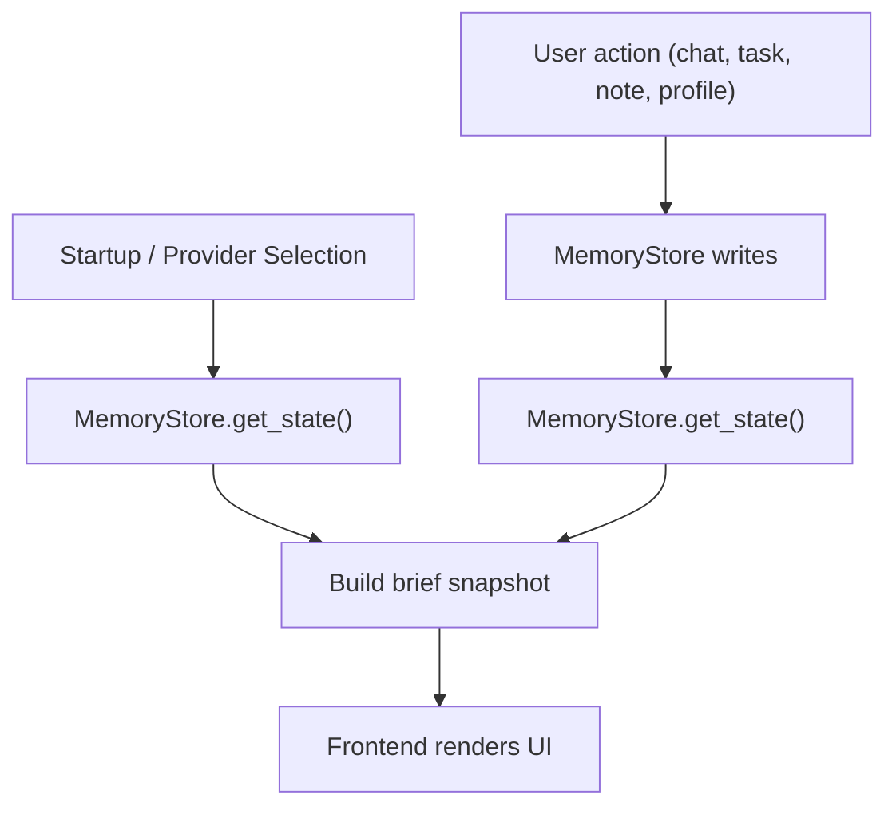

**Diagram sources**
- [backend/core/memory_store.py:188-276](file://backend/core/memory_store.py#L188-L276)
- [backend/server.py:506-520](file://backend/server.py#L506-L520)

**Section sources**
- [backend/core/memory_store.py:188-276](file://backend/core/memory_store.py#L188-L276)
- [backend/server.py:506-520](file://backend/server.py#L506-L520)

### Attachment Processing Pipeline
- Frontend uploads base64-encoded files; server validates type and size, saves to disk under data/uploads, registers in MongoDB, parses and indexes for session-scoped search, and returns attachment metadata.
- Session-scoped retriever is lazily built and cached; invalidated on cleanup.

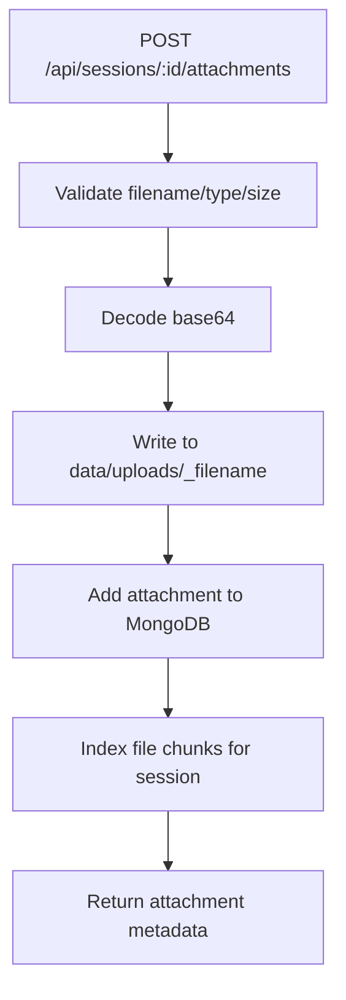

**Diagram sources**
- [backend/server.py:329-394](file://backend/server.py#L329-L394)
- [backend/tools/knowledge.py:303-335](file://backend/tools/knowledge.py#L303-L335)

**Section sources**
- [backend/server.py:329-394](file://backend/server.py#L329-L394)
- [backend/tools/knowledge.py:303-335](file://backend/tools/knowledge.py#L303-L335)

### Knowledge Retrieval Flow
- Persistent knowledge base: Documents in knowledge_base/ are parsed, chunked, hashed, and indexed into MongoDB; retriever built on startup.
- Session-scoped documents: Attached files are chunked and indexed per session; retriever built lazily and cached.
- Hybrid retrieval: Optional FAISS + BM25 ensemble when embeddings are available.

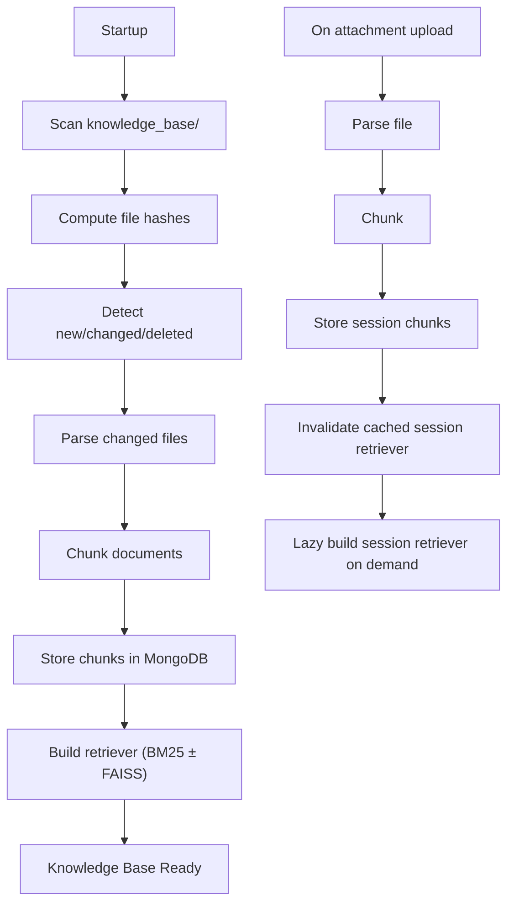

**Diagram sources**
- [backend/tools/knowledge.py:145-230](file://backend/tools/knowledge.py#L145-L230)
- [backend/tools/knowledge.py:357-387](file://backend/tools/knowledge.py#L357-L387)

**Section sources**
- [backend/tools/knowledge.py:145-230](file://backend/tools/knowledge.py#L145-L230)
- [backend/tools/knowledge.py:357-387](file://backend/tools/knowledge.py#L357-L387)

### Data Transformation and Validation
- Input validation: Non-empty messages, valid session IDs, allowed file types, size limits, and JSON parsing with fallbacks.
- Output transformation: Tool results are normalized into standardized event payloads; memory snapshots are compacted for prompts and UI.
- Error propagation: Exceptions are caught and mapped to structured JSON with HTTP status codes.

**Section sources**
- [backend/server.py:295-321](file://backend/server.py#L295-L321)
- [backend/server.py:329-394](file://backend/server.py#L329-L394)
- [backend/core/orbit_brain.py:389-502](file://backend/core/orbit_brain.py#L389-L502)

### Session Lifecycle Management
- Creation, listing, updating (title/pinned/archived), and deletion with cascading cleanup of messages, attachments, and session chunks.
- Deletion also removes uploaded files from disk and invalidates session retrievers.

**Section sources**
- [backend/server.py:432-446](file://backend/server.py#L432-L446)
- [backend/core/memory_store.py:579-646](file://backend/core/memory_store.py#L579-L646)
- [backend/tools/knowledge.py:389-393](file://backend/tools/knowledge.py#L389-L393)

### Asynchronous Operation Handling
- Web search uses a spinner timer to indicate progress; search results are returned synchronously to the tool loop.
- Embedding index builds are logged and timed; failures fall back to BM25-only retrieval.
- Attachment indexing is performed synchronously during upload; session retrievers are cached for subsequent queries.

**Section sources**
- [backend/tools/web_search.py:12-41](file://backend/tools/web_search.py#L12-L41)
- [backend/tools/knowledge.py:241-264](file://backend/tools/knowledge.py#L241-L264)
- [backend/tools/knowledge.py:357-387](file://backend/tools/knowledge.py#L357-L387)

## Dependency Analysis
- Coupling: LLMAssistant depends on MemoryStore, KnowledgeService, WebSearchService, WeatherService, and NewsService.
- Cohesion: Each tool module encapsulates a single responsibility (weather, news, web search, knowledge).
- External dependencies: MongoDB, OpenRouter/LM Studio/Ollama, Tavily/DuckDuckGo, LangChain/FAISS/BM25.

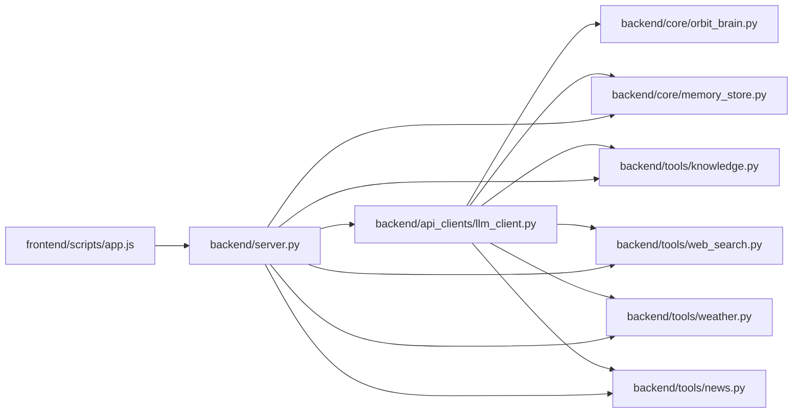

**Diagram sources**
- [frontend/scripts/app.js:1-1765](file://frontend/scripts/app.js#L1-L1765)
- [backend/server.py:1-611](file://backend/server.py#L1-L611)
- [backend/api_clients/llm_client.py:1-366](file://backend/api_clients/llm_client.py#L1-L366)
- [backend/core/orbit_brain.py:1-502](file://backend/core/orbit_brain.py#L1-L502)
- [backend/core/memory_store.py:1-947](file://backend/core/memory_store.py#L1-L947)
- [backend/tools/knowledge.py:1-393](file://backend/tools/knowledge.py#L1-L393)
- [backend/tools/web_search.py:1-139](file://backend/tools/web_search.py#L1-L139)
- [backend/tools/weather.py:1-141](file://backend/tools/weather.py#L1-L141)
- [backend/tools/news.py:1-83](file://backend/tools/news.py#L1-L83)

**Section sources**
- [backend/server.py:1-611](file://backend/server.py#L1-L611)
- [backend/api_clients/llm_client.py:1-366](file://backend/api_clients/llm_client.py#L1-L366)

## Performance Considerations
- Caching: Session retrievers are cached and invalidated on changes; spinner timers provide user feedback during long operations.
- Indexing: Knowledge base indexing is incremental (hash-based); session retrievers are lazy-built to reduce startup cost.
- Tool loop limits: Prevent infinite loops and ensure timely completion.
- Provider selection: OpenRouter-compatible endpoints offer flexibility; Google REST API is streamlined for tool-calling.
- MongoDB: Proper indexes on session/message/activity/chunks improve query performance.

[No sources needed since this section provides general guidance]

## Troubleshooting Guide
- API Key missing: LLM client raises an error if the active provider’s API key is not configured.
- Provider errors: HTTPError/URLError mapped to structured errors with details; moderation blocks return a safety message.
- Validation errors: Empty messages, invalid session IDs, unsupported file types, and oversized files are rejected with HTTP 400.
- Tool errors: Weather/news errors and key/value errors are captured and returned as tool events.
- MongoDB connectivity: ConnectionFailure raises a clear error indicating the server is unreachable.

**Section sources**
- [backend/api_clients/llm_client.py:60-61](file://backend/api_clients/llm_client.py#L60-L61)
- [backend/api_clients/llm_client.py:161-174](file://backend/api_clients/llm_client.py#L161-L174)
- [backend/server.py:295-321](file://backend/server.py#L295-L321)
- [backend/server.py:336-361](file://backend/server.py#L336-L361)
- [backend/core/memory_store.py:92-98](file://backend/core/memory_store.py#L92-L98)

## Conclusion
The Orbit Virtual Assistant implements a robust, layered data flow from frontend to backend, with strong separation of concerns, persistent memory, and flexible tooling. The system emphasizes safety, consistency, and performance through careful validation, caching, and provider-agnostic design.

[No sources needed since this section summarizes without analyzing specific files]

## Appendices

### Typical User Interaction Sequence
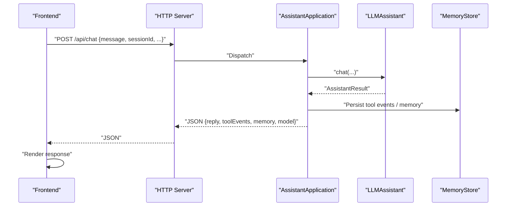

**Diagram sources**
- [backend/server.py:276-321](file://backend/server.py#L276-L321)
- [backend/api_clients/llm_client.py:47-78](file://backend/api_clients/llm_client.py#L47-L78)
- [backend/core/memory_store.py:188-250](file://backend/core/memory_store.py#L188-L250)

### Data Models Overview
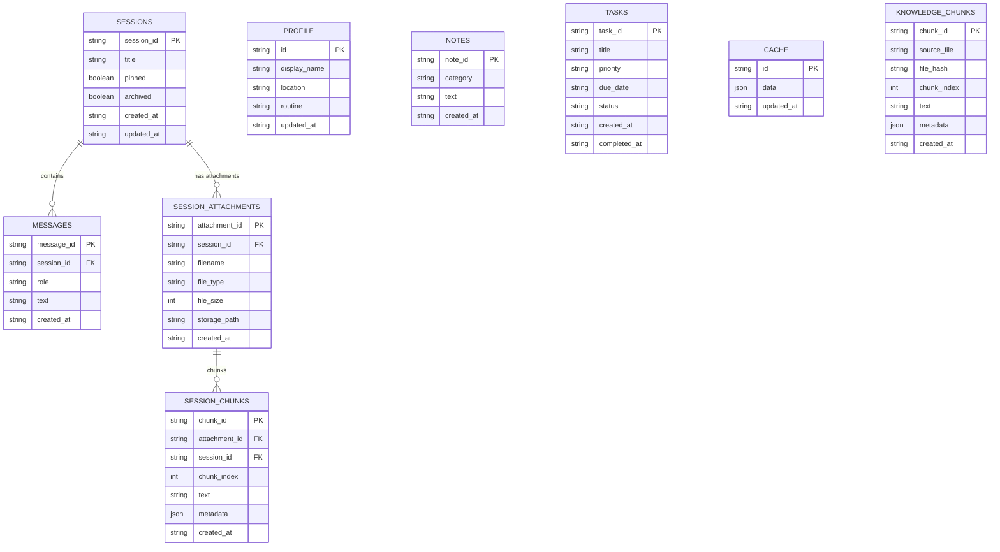

**Diagram sources**
- [backend/core/memory_store.py:24-62](file://backend/core/memory_store.py#L24-L62)