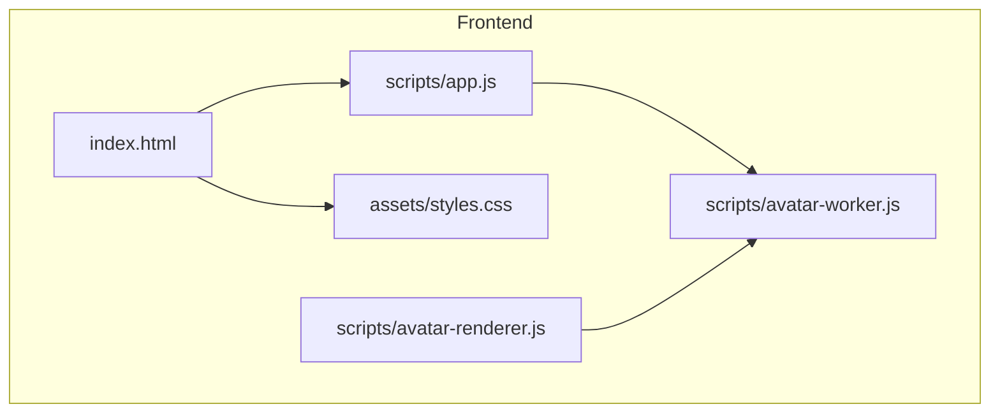
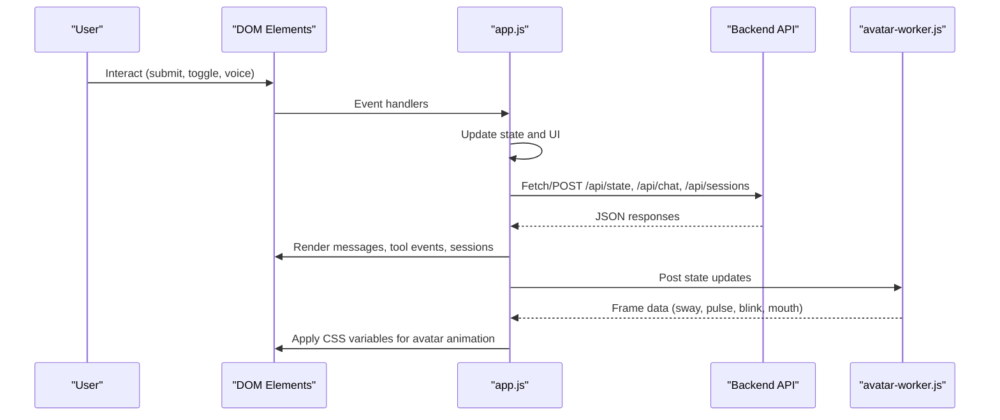
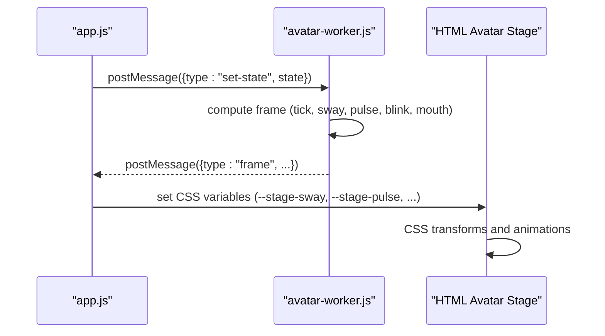
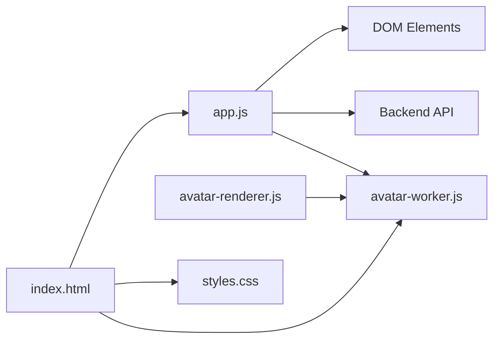

# Frontend Architecture

<cite>
**Referenced Files in This Document**
- [index.html](file://frontend/index.html)
- [styles.css](file://frontend/assets/styles.css)
- [app.js](file://frontend/scripts/app.js)
- [avatar-renderer.js](file://frontend/scripts/avatar-renderer.js)
- [avatar-worker.js](file://frontend/scripts/avatar-worker.js)
</cite>

## Table of Contents
1. [Introduction](#introduction)
2. [Project Structure](#project-structure)
3. [Core Components](#core-components)
4. [Architecture Overview](#architecture-overview)
5. [Detailed Component Analysis](#detailed-component-analysis)
6. [Dependency Analysis](#dependency-analysis)
7. [Performance Considerations](#performance-considerations)
8. [Troubleshooting Guide](#troubleshooting-guide)
9. [Conclusion](#conclusion)

## Introduction
This document describes the frontend architecture for the Orbit Virtual Assistant, focusing on the vanilla JavaScript implementation with HTML5 semantic markup, CSS styling with animations, and modular script organization. It explains the main application state management, session handling, UI interaction patterns, and the component relationships between the main application logic, avatar rendering system, and asset delivery mechanisms. It also covers responsive design patterns, accessibility features, cross-browser compatibility considerations, and the frontend-backend communication protocols with state synchronization strategies and real-time update mechanisms.

## Project Structure
The frontend is organized around a single HTML entry point, a centralized stylesheet, and three modular JavaScript modules:
- index.html: Semantic HTML structure with interactive UI regions
- assets/styles.css: CSS variables, layout, responsive design, and animations
- scripts/app.js: Main application logic, state management, UI interactions, and API communication
- scripts/avatar-renderer.js: Canvas-based avatar animation (optional module)
- scripts/avatar-worker.js: Web Worker for avatar computation

**Diagram sources**
- [index.html](file://frontend/index.html)
- [styles.css](file://frontend/assets/styles.css)
- [app.js](file://frontend/scripts/app.js)
- [avatar-renderer.js](file://frontend/scripts/avatar-renderer.js)
- [avatar-worker.js](file://frontend/scripts/avatar-worker.js)

**Section sources**
- [index.html](file://frontend/index.html)
- [styles.css](file://frontend/assets/styles.css)
- [app.js](file://frontend/scripts/app.js)

## Core Components
- Application state container: Centralized state object managing UI modes, sessions, voice, avatar, and composer toggles
- DOM element registry: Cached references to all interactive elements for efficient updates
- Avatar worker pipeline: Web Worker that computes avatar frames and posts them to the main thread
- Message rendering engine: Dynamic creation and formatting of chat bubbles with Markdown support
- Session management: CRUD operations for chat sessions with persistence and UI sync
- Voice input system: Dual-mode speech recognition (review-before-send and instant-send) with TTS synthesis
- Screen sharing: Media capture and periodic frame capture for context-aware assistance
- Asset delivery: Static resources served via local paths and CDN-hosted Markdown parser

**Section sources**
- [app.js](file://frontend/scripts/app.js)
- [avatar-worker.js](file://frontend/scripts/avatar-worker.js)

## Architecture Overview
The frontend follows a modular, event-driven architecture:
- index.html defines semantic regions for sidebar, header, chat area, and utility drawer
- styles.css provides a dark/light theme with CSS variables, responsive breakpoints, and smooth transitions
- app.js orchestrates state, UI updates, and API interactions
- avatar-worker.js runs independently to compute avatar animations off the main thread
- avatar-renderer.js demonstrates an alternative canvas-based renderer (optional)

**Diagram sources**
- [app.js](file://frontend/scripts/app.js)
- [avatar-worker.js](file://frontend/scripts/avatar-worker.js)

## Detailed Component Analysis

### Application State Management
The application maintains a single state object with:
- Mode and preferences: simple/copilot/coach modes, language settings, and UI panel states
- Conversation and memory: current conversation turns, tool events, and persistent memory
- Sessions: active session ID, list of sessions, and processing flags
- Voice: speech recognition lifecycle, dual-mode controls, and TTS synthesis
- Avatar: Web Worker reference and stage state
- Composer toggles: web search, thinking, image generation, offline mode

State updates are centralized and trigger UI re-renders and API calls. Local storage persists UI preferences across sessions.

**Section sources**
- [app.js](file://frontend/scripts/app.js)

### UI Interaction Patterns
- Event delegation and binding: All interactive elements are bound in a single initialization routine
- Dual voice modes: Mode A (Ctrl+M) for review-before-send; Mode B (hold Control) for instant-send
- Composer toggles: Mutually exclusive web search and offline modes; thinking/image generation toggles
- Session actions: Pin/unpin, archive/unarchive, delete with confirmation
- Quick actions and practice buttons: Predefined prompts with optional screen context
- Screen sharing: Start/stop with preview canvas and periodic frame capture

**Section sources**
- [app.js](file://frontend/scripts/app.js)

### Avatar Rendering System
The avatar system consists of:
- Web Worker avatar-worker.js: Computes avatar state (sway, pulse, blink, mouth) on a loop
- Main-thread integration: app.js receives frame data and applies CSS variables to animate the avatar stage
- Optional canvas renderer: avatar-renderer.js provides an alternative canvas-based animation pipeline

**Diagram sources**
- [app.js](file://frontend/scripts/app.js)
- [avatar-worker.js](file://frontend/scripts/avatar-worker.js)

**Section sources**
- [app.js](file://frontend/scripts/app.js)
- [avatar-worker.js](file://frontend/scripts/avatar-worker.js)
- [avatar-renderer.js](file://frontend/scripts/avatar-renderer.js)

### Session Handling and Persistence
- Creation: First message triggers session creation via POST /api/sessions
- Loading: Clicking a session item loads messages via GET /api/sessions/:id/messages
- Updates: Pin/archive toggles update session metadata via PUT /api/sessions/:id
- Deletion: DELETE /api/sessions/:id removes a session and clears UI
- Sync: refreshSessions keeps the sidebar synchronized with backend state

**Diagram sources**
- [app.js](file://frontend/scripts/app.js)

**Section sources**
- [app.js](file://frontend/scripts/app.js)

### Voice Input and TTS
- Speech recognition: Uses browser SpeechRecognition with fallbacks and language selection
- Dual modes: Mode A records then reviews; Mode B captures instantly and sends
- TTS synthesis: Optional speech synthesis with voice selection and cleanup on completion
- UI feedback: Mic button states, voice status indicators, and stage state changes

**Section sources**
- [app.js](file://frontend/scripts/app.js)

### Screen Sharing and Context
- Capture: getDisplayMedia starts a video stream and renders preview
- Periodic capture: Interval-based frame capture converts to data URL for context
- Integration: Latest screen image is attached to subsequent prompts when enabled

**Section sources**
- [app.js](file://frontend/scripts/app.js)

### Frontend-Backend Communication Protocols
- REST endpoints: /api/state, /api/chat, /api/sessions, /api/profile, /api/weather, /api/news, /api/tasks, /api/notes
- Request bodies: JSON payloads carrying conversation, mode flags, and optional attachments
- Responses: JSON with replies, tool events, memory snapshots, and session data
- Error handling: Graceful degradation with user-visible messages and state reset

**Section sources**
- [app.js](file://frontend/scripts/app.js)

### Responsive Design and Accessibility
- Responsive layout: Flexbox-based main layout with collapsible sidebar and constrained message widths
- CSS variables: Theme tokens for backgrounds, borders, shadows, and radii
- Animations: Smooth transitions for sidebar collapse, drawer open/close, and message appearance
- Accessibility: Semantic HTML, ARIA-compliant selects, focusable elements, and keyboard shortcuts
- Cross-browser compatibility: Feature detection for Web Worker, SpeechRecognition, and media devices

**Section sources**
- [styles.css](file://frontend/assets/styles.css)
- [index.html](file://frontend/index.html)
- [app.js](file://frontend/scripts/app.js)

## Dependency Analysis
The frontend modules exhibit clear separation of concerns:
- app.js depends on DOM elements, Web Worker avatar pipeline, and backend APIs
- avatar-worker.js is a pure computation module with no DOM dependencies
- avatar-renderer.js optionally depends on avatar-worker.js and canvas APIs
- index.html depends on styles.css and script modules
- styles.css is self-contained and does not import other files

**Diagram sources**
- [app.js](file://frontend/scripts/app.js)
- [avatar-worker.js](file://frontend/scripts/avatar-worker.js)
- [avatar-renderer.js](file://frontend/scripts/avatar-renderer.js)
- [index.html](file://frontend/index.html)
- [styles.css](file://frontend/assets/styles.css)

**Section sources**
- [app.js](file://frontend/scripts/app.js)
- [avatar-worker.js](file://frontend/scripts/avatar-worker.js)
- [avatar-renderer.js](file://frontend/scripts/avatar-renderer.js)
- [index.html](file://frontend/index.html)
- [styles.css](file://frontend/assets/styles.css)

## Performance Considerations
- Off-main-thread computation: Avatar frames computed in Web Worker prevent UI jank
- Efficient DOM updates: Batched rendering and minimal reflows; autosizing textarea avoids layout thrash
- Lazy initialization: Voice and avatar workers initialized only when supported
- Debounced UI updates: Composer state disabled during processing to prevent concurrent requests
- Asset optimization: CDN-hosted Markdown parser reduces bundle size

## Troubleshooting Guide
Common issues and resolutions:
- Voice recognition unavailable: Check browser support and permissions; UI disables mic button accordingly
- Avatar not animating: Verify Web Worker support; fallback to static avatar if unsupported
- Session loading errors: Confirm backend connectivity and session existence
- Screen sharing failures: Ensure HTTPS context and user permission; handle track ended events
- Large file uploads: Backend enforces size limits; UI warns and prevents oversized attachments

**Section sources**
- [app.js](file://frontend/scripts/app.js)

## Conclusion
The Orbit Virtual Assistant frontend employs a clean, modular architecture leveraging vanilla JavaScript, semantic HTML, and CSS animations. The app.js module centralizes state and interactions while delegating heavy computations to a Web Worker avatar pipeline. The design emphasizes responsiveness, accessibility, and cross-browser compatibility, with robust frontend-backend communication and graceful error handling.