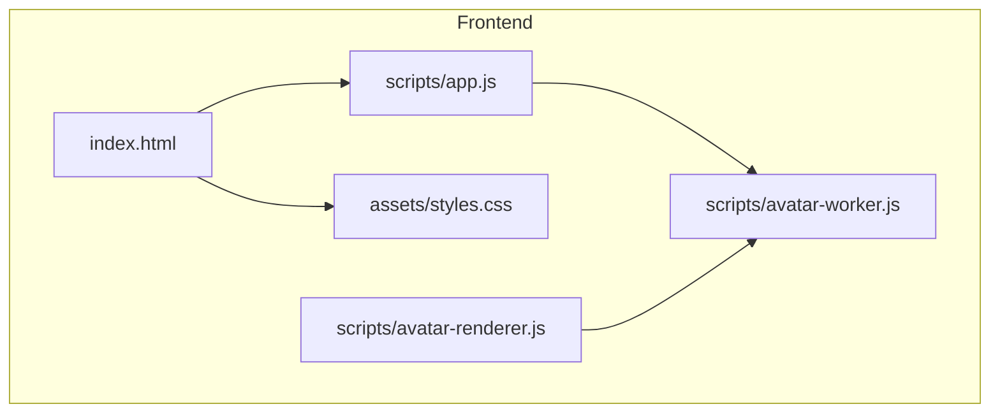
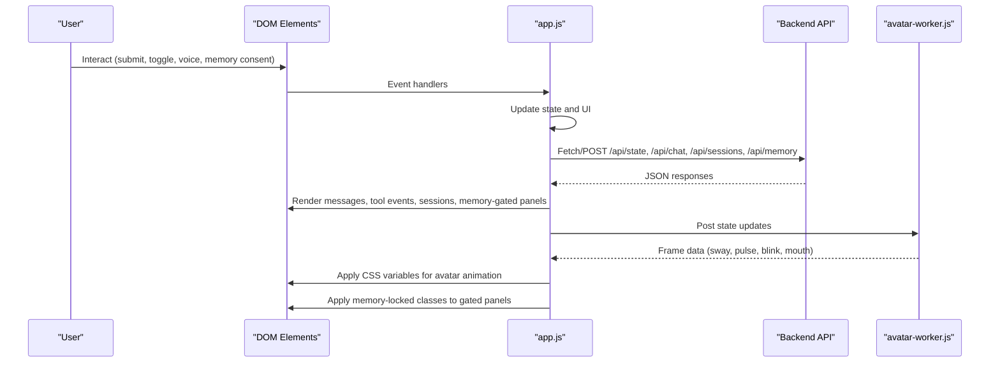
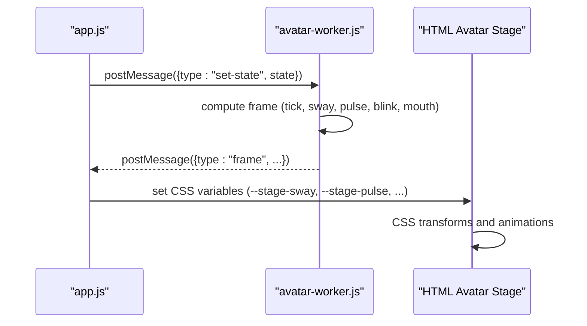
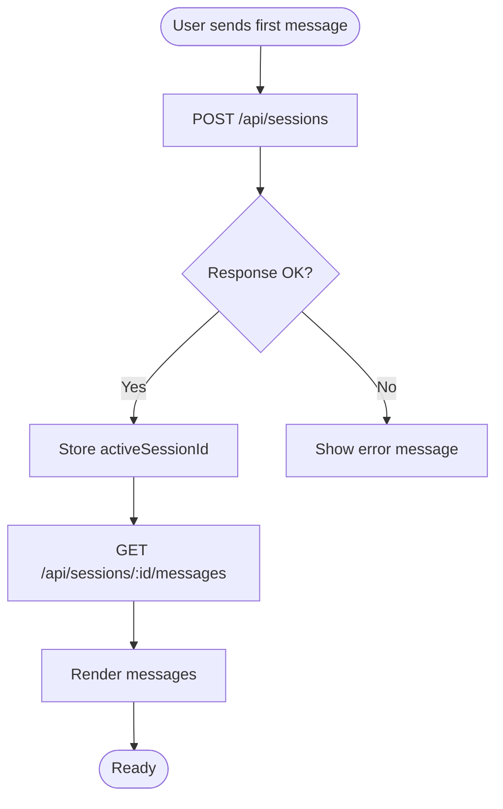
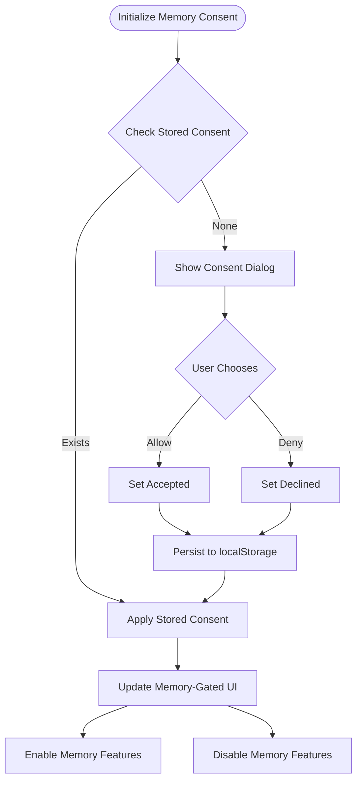
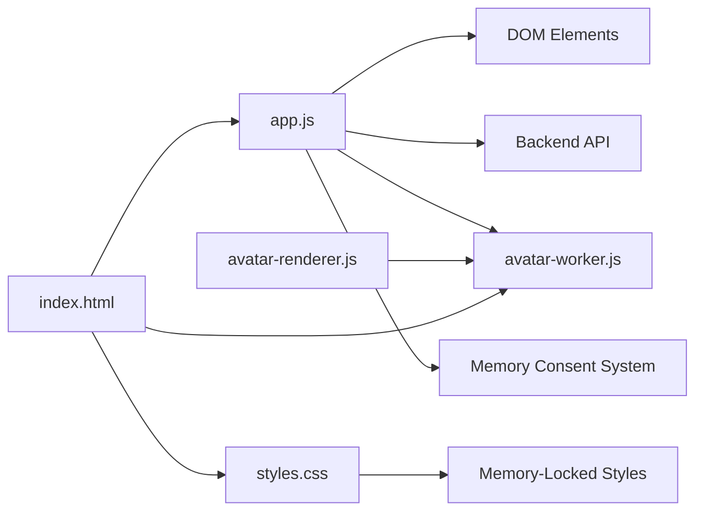

# Frontend Architecture

<cite>
**Referenced Files in This Document**
- [index.html](file://frontend/index.html)
- [styles.css](file://frontend/assets/styles.css)
- [app.js](file://frontend/scripts/app.js)
- [avatar-renderer.js](file://frontend/scripts/avatar-renderer.js)
- [avatar-worker.js](file://frontend/scripts/avatar-worker.js)
</cite>

## Update Summary
**Changes Made**
- Added comprehensive Agent Memory section with Allow/Disable buttons and consent management
- Implemented memory consent UI controls with visual feedback through memory-locked CSS classes
- Enhanced memory-gated panels that automatically disable based on user preferences
- Added automatic UI state management for memory-enabled/disabled scenarios
- Updated state management to include memory consent tracking and persistence

## Table of Contents
1. [Introduction](#introduction)
2. [Project Structure](#project-structure)
3. [Core Components](#core-components)
4. [Architecture Overview](#architecture-overview)
5. [Detailed Component Analysis](#detailed-component-analysis)
6. [Dependency Analysis](#dependency-analysis)
7. [Performance Considerations](#performance-considerations)
8. [Troubleshooting Guide](#troubleshooting-guide)
9. [Conclusion](#conclusion)

## Introduction
This document describes the frontend architecture for the Orbit Virtual Assistant, focusing on the vanilla JavaScript implementation with HTML5 semantic markup, CSS styling with animations, and modular script organization. It explains the main application state management, session handling, UI interaction patterns, and the component relationships between the main application logic, avatar rendering system, and asset delivery mechanisms. It also covers responsive design patterns, accessibility features, cross-browser compatibility considerations, and the frontend-backend communication protocols with state synchronization strategies and real-time update mechanisms.

**Updated** Enhanced with comprehensive Agent Memory system featuring consent management, memory-gated UI controls, and automatic state synchronization.

## Project Structure
The frontend is organized around a single HTML entry point, a centralized stylesheet, and three modular JavaScript modules:
- index.html: Semantic HTML structure with interactive UI regions and Agent Memory controls
- assets/styles.css: CSS variables, layout, responsive design, animations, and memory-locked styling
- scripts/app.js: Main application logic, state management, UI interactions, API communication, and memory consent handling
- scripts/avatar-renderer.js: Canvas-based avatar animation (optional module)
- scripts/avatar-worker.js: Web Worker for avatar computation

**Diagram sources**
- [index.html](file://frontend/index.html)
- [styles.css](file://frontend/assets/styles.css)
- [app.js](file://frontend/scripts/app.js)
- [avatar-renderer.js](file://frontend/scripts/avatar-renderer.js)
- [avatar-worker.js](file://frontend/scripts/avatar-worker.js)

**Section sources**
- [index.html](file://frontend/index.html)
- [styles.css](file://frontend/assets/styles.css)
- [app.js](file://frontend/scripts/app.js)

## Core Components
- Application state container: Centralized state object managing UI modes, sessions, voice, avatar, composer toggles, and memory consent preferences
- DOM element registry: Cached references to all interactive elements including memory controls and gated panels
- Avatar worker pipeline: Web Worker that computes avatar frames and posts them to the main thread
- Message rendering engine: Dynamic creation and formatting of chat bubbles with Markdown support
- Session management: CRUD operations for chat sessions with persistence and UI sync
- Voice input system: Dual-mode speech recognition (review-before-send and instant-send) with TTS synthesis
- Screen sharing: Media capture and periodic frame capture for context-aware assistance
- Asset delivery: Static resources served via local paths and CDN-hosted Markdown parser
- **Memory consent system**: User-controlled memory access with automatic UI state management and visual feedback

**Updated** Added comprehensive memory consent system with automatic UI state management and memory-gated controls.

**Section sources**
- [app.js](file://frontend/scripts/app.js)
- [avatar-worker.js](file://frontend/scripts/avatar-worker.js)

## Architecture Overview
The frontend follows a modular, event-driven architecture with enhanced memory management:
- index.html defines semantic regions for sidebar, header, chat area, utility drawer, and Agent Memory controls
- styles.css provides a dark/light theme with CSS variables, responsive breakpoints, smooth transitions, and memory-locked styling
- app.js orchestrates state, UI updates, API interactions, and memory consent management
- avatar-worker.js runs independently to compute avatar animations off the main thread
- avatar-renderer.js demonstrates an alternative canvas-based renderer (optional)

**Diagram sources**
- [app.js](file://frontend/scripts/app.js)
- [avatar-worker.js](file://frontend/scripts/avatar-worker.js)

## Detailed Component Analysis

### Application State Management
The application maintains a single state object with:
- Mode and preferences: simple/copilot/coach modes, language settings, and UI panel states
- Conversation and memory: current conversation turns, tool events, and persistent memory with consent tracking
- Sessions: active session ID, list of sessions, and processing flags
- Voice: speech recognition lifecycle, dual-mode controls, and TTS synthesis
- Avatar: Web Worker reference and stage state
- Composer toggles: web search, thinking, image generation, offline mode
- **Memory state**: Consent preferences, availability flags, and gated UI controls

**Updated** Enhanced state management includes comprehensive memory consent tracking and UI state synchronization.

State updates are centralized and trigger UI re-renders and API calls. Local storage persists UI preferences and memory consent across sessions.

**Section sources**
- [app.js](file://frontend/scripts/app.js)

### UI Interaction Patterns
- Event delegation and binding: All interactive elements are bound in a single initialization routine
- Dual voice modes: Mode A (Ctrl+M) for review-before-send; Mode B (hold Control) for instant-send
- Composer toggles: Mutually exclusive web search and offline modes; thinking/image generation toggles
- Session actions: Pin/unpin, archive/unarchive, delete with confirmation
- Quick actions and practice buttons: Predefined prompts with optional screen context
- Screen sharing: Start/stop with preview canvas and periodic frame capture
- **Memory controls**: Allow/Disable buttons with visual feedback and automatic UI state management

**Updated** Added memory consent controls with automatic UI state management and visual feedback.

**Section sources**
- [app.js](file://frontend/scripts/app.js)

### Avatar Rendering System
The avatar system consists of:
- Web Worker avatar-worker.js: Computes avatar state (sway, pulse, blink, mouth) on a loop
- Main-thread integration: app.js receives frame data and applies CSS variables to animate the avatar stage
- Optional canvas renderer: avatar-renderer.js provides an alternative canvas-based animation pipeline

**Diagram sources**
- [app.js](file://frontend/scripts/app.js)
- [avatar-worker.js](file://frontend/scripts/avatar-worker.js)

**Section sources**
- [app.js](file://frontend/scripts/app.js)
- [avatar-worker.js](file://frontend/scripts/avatar-worker.js)
- [avatar-renderer.js](file://frontend/scripts/avatar-renderer.js)

### Session Handling and Persistence
- Creation: First message triggers session creation via POST /api/sessions
- Loading: Clicking a session item loads messages via GET /api/sessions/:id/messages
- Updates: Pin/archive toggles update session metadata via PUT /api/sessions/:id
- Deletion: DELETE /api/sessions/:id removes a session and clears UI
- Sync: refreshSessions keeps the sidebar synchronized with backend state

**Diagram sources**
- [app.js](file://frontend/scripts/app.js)

**Section sources**
- [app.js](file://frontend/scripts/app.js)

### Voice Input and TTS
- Speech recognition: Uses browser SpeechRecognition with fallbacks and language selection
- Dual modes: Mode A records then reviews; Mode B captures instantly and sends
- TTS synthesis: Optional speech synthesis with voice selection and cleanup on completion
- UI feedback: Mic button states, voice status indicators, and stage state changes

**Section sources**
- [app.js](file://frontend/scripts/app.js)

### Screen Sharing and Context
- Capture: getDisplayMedia starts a video stream and renders preview
- Periodic capture: Interval-based frame capture converts to data URL for context
- Integration: Latest screen image is attached to subsequent prompts when enabled

**Section sources**
- [app.js](file://frontend/scripts/app.js)

### Memory Consent System
The memory consent system provides:
- **Consent initialization**: Automatic detection of stored consent preferences or user confirmation dialog
- **Allow/Disable controls**: Dedicated buttons in the utility drawer for memory access management
- **Visual feedback**: Status indicators showing current memory consent state and availability
- **Memory-gated panels**: Automatic disabling of memory-dependent features when consent is not granted
- **Automatic UI state management**: CSS classes applied to panels and controls based on memory availability
- **Persistence**: Local storage of consent decisions across browser sessions

**New Section** Comprehensive memory consent system with automatic UI state management and visual feedback.

**Diagram sources**
- [app.js](file://frontend/scripts/app.js)

**Section sources**
- [app.js](file://frontend/scripts/app.js)

### Frontend-Backend Communication Protocols
- REST endpoints: /api/state, /api/chat, /api/sessions, /api/profile, /api/weather, /api/news, /api/tasks, /api/notes, /api/memory
- Request bodies: JSON payloads carrying conversation, mode flags, memory consent, and optional attachments
- Responses: JSON with replies, tool events, memory snapshots, session data, and memory state
- Error handling: Graceful degradation with user-visible messages and state reset
- **Memory-aware requests**: Automatic inclusion of memory consent status in API calls

**Updated** Added memory-aware API communication with automatic consent status inclusion.

**Section sources**
- [app.js](file://frontend/scripts/app.js)

### Responsive Design and Accessibility
- Responsive layout: Flexbox-based main layout with collapsible sidebar and constrained message widths
- CSS variables: Theme tokens for backgrounds, borders, shadows, and radii
- Animations: Smooth transitions for sidebar collapse, drawer open/close, message appearance, and memory-locked effects
- Accessibility: Semantic HTML, ARIA-compliant selects, focusable elements, keyboard shortcuts, and memory consent dialogs
- Cross-browser compatibility: Feature detection for Web Worker, SpeechRecognition, media devices, and memory consent APIs
- **Memory-locked styling**: Visual feedback through reduced opacity and muted colors for disabled memory features

**Updated** Enhanced accessibility with memory consent dialogs and visual feedback for memory-disabled states.

**Section sources**
- [styles.css](file://frontend/assets/styles.css)
- [index.html](file://frontend/index.html)
- [app.js](file://frontend/scripts/app.js)

## Dependency Analysis
The frontend modules exhibit clear separation of concerns with enhanced memory management:
- app.js depends on DOM elements, Web Worker avatar pipeline, backend APIs, and memory consent system
- avatar-worker.js is a pure computation module with no DOM dependencies
- avatar-renderer.js optionally depends on avatar-worker.js and canvas APIs
- index.html depends on styles.css, script modules, and memory consent controls
- styles.css is self-contained with memory-locked styling and does not import other files

**Diagram sources**
- [app.js](file://frontend/scripts/app.js)
- [avatar-worker.js](file://frontend/scripts/avatar-worker.js)
- [avatar-renderer.js](file://frontend/scripts/avatar-renderer.js)
- [index.html](file://frontend/index.html)
- [styles.css](file://frontend/assets/styles.css)

**Section sources**
- [app.js](file://frontend/scripts/app.js)
- [avatar-worker.js](file://frontend/scripts/avatar-worker.js)
- [avatar-renderer.js](file://frontend/scripts/avatar-renderer.js)
- [index.html](file://frontend/index.html)
- [styles.css](file://frontend/assets/styles.css)

## Performance Considerations
- Off-main-thread computation: Avatar frames computed in Web Worker prevent UI jank
- Efficient DOM updates: Batched rendering and minimal reflows; autosizing textarea avoids layout thrash
- Lazy initialization: Voice and avatar workers initialized only when supported
- Debounced UI updates: Composer state disabled during processing to prevent concurrent requests
- Asset optimization: CDN-hosted Markdown parser reduces bundle size
- **Memory-gated performance**: Disabled memory features reduce unnecessary API calls and DOM updates

**Updated** Added performance considerations for memory-gated UI controls and reduced API calls.

## Troubleshooting Guide
Common issues and resolutions:
- Voice recognition unavailable: Check browser support and permissions; UI disables mic button accordingly
- Avatar not animating: Verify Web Worker support; fallback to static avatar if unsupported
- Session loading errors: Confirm backend connectivity and session existence
- Screen sharing failures: Ensure HTTPS context and user permission; handle track ended events
- Large file uploads: Backend enforces size limits; UI warns and prevents oversized attachments
- **Memory consent issues**: Check localStorage for consent values; confirm backend memory availability; verify memory-gated panel states
- **Memory feature disabled**: Verify memory consent status; check storage mode configuration; ensure proper UI state application

**Updated** Added troubleshooting guidance for memory consent and memory-gated features.

**Section sources**
- [app.js](file://frontend/scripts/app.js)

## Conclusion
The Orbit Virtual Assistant frontend employs a clean, modular architecture leveraging vanilla JavaScript, semantic HTML, and CSS animations. The app.js module centralizes state and interactions while delegating heavy computations to a Web Worker avatar pipeline. The design emphasizes responsiveness, accessibility, and cross-browser compatibility, with robust frontend-backend communication and graceful error handling.

**Updated** Enhanced with comprehensive memory consent management, automatic UI state synchronization, and memory-gated controls that provide users with granular control over their data privacy while maintaining seamless application functionality.