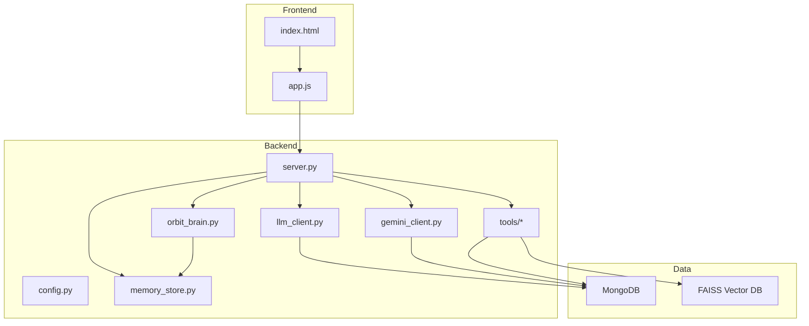
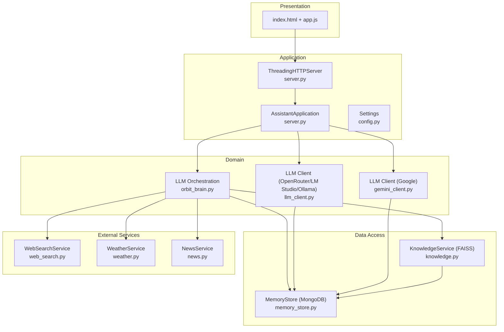
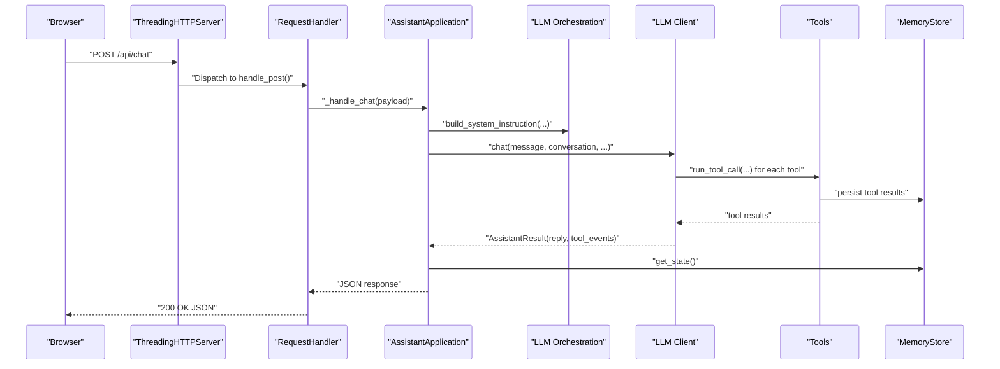
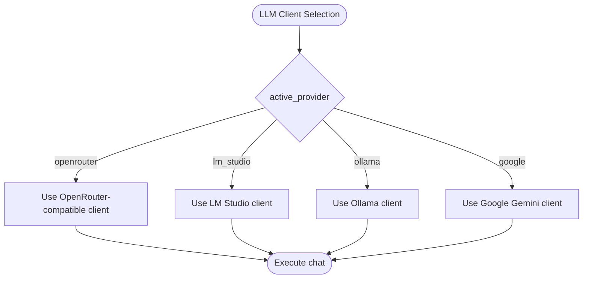
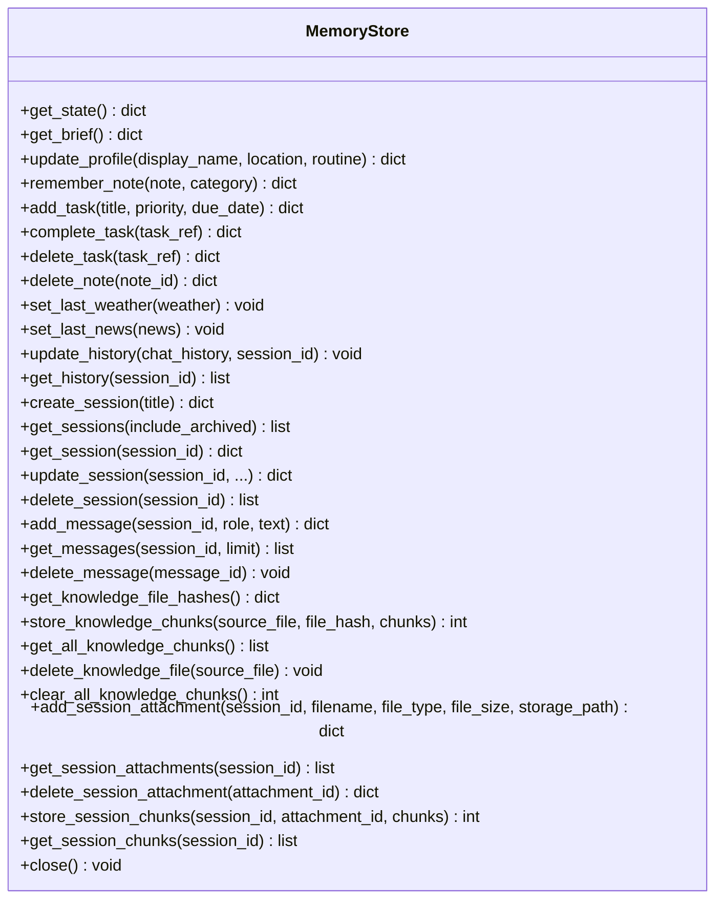
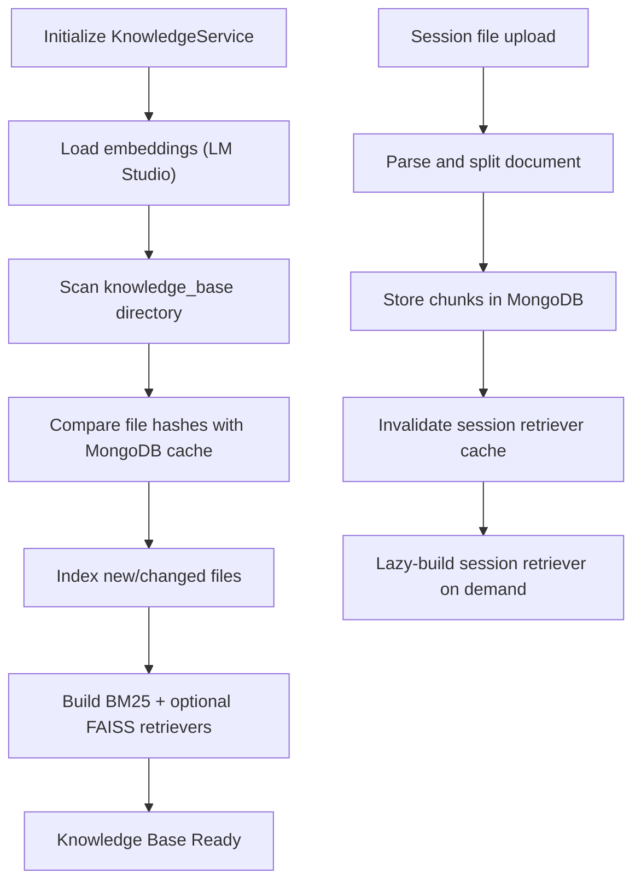
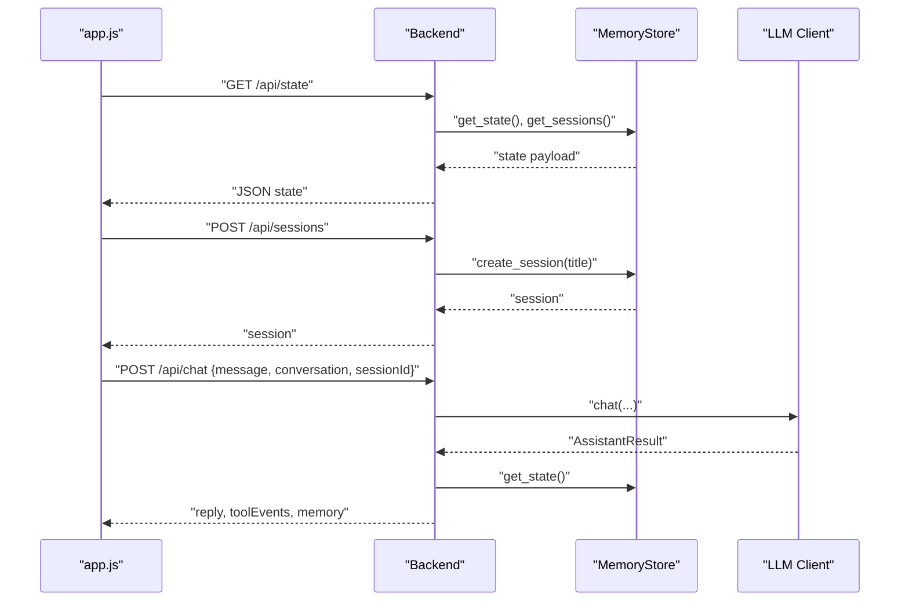
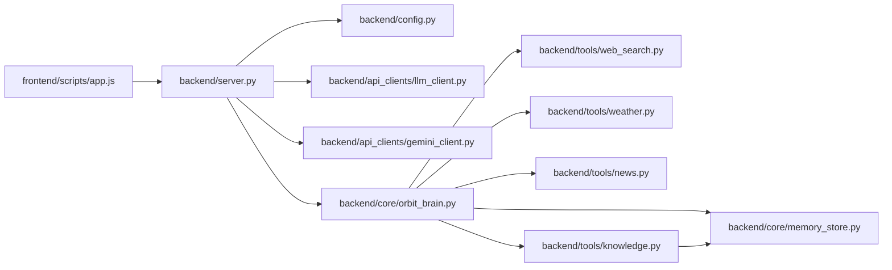
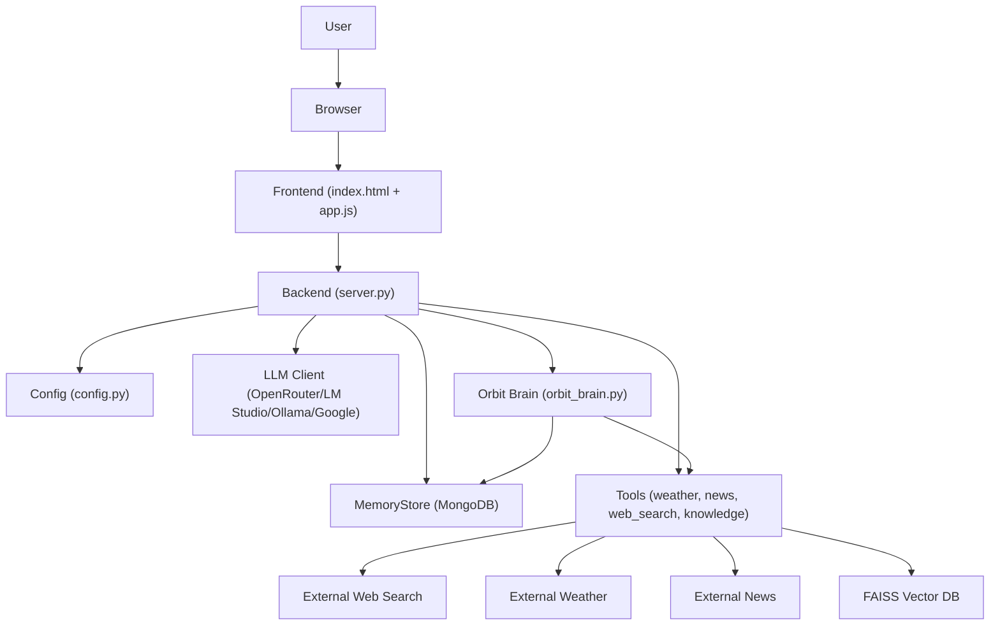

# System Architecture

<cite>
**Referenced Files in This Document**
- [run.py](file://run.py)
- [server.py](file://backend/server.py)
- [config.py](file://backend/config.py)
- [llm_client.py](file://backend/api_clients/llm_client.py)
- [gemini_client.py](file://backend/api_clients/gemini_client.py)
- [memory_store.py](file://backend/core/memory_store.py)
- [orbit_brain.py](file://backend/core/orbit_brain.py)
- [knowledge.py](file://backend/tools/knowledge.py)
- [web_search.py](file://backend/tools/web_search.py)
- [weather.py](file://backend/tools/weather.py)
- [news.py](file://backend/tools/news.py)
- [app.js](file://frontend/scripts/app.js)
- [index.html](file://frontend/index.html)
- [requirements.txt](file://requirements.txt)
</cite>

## Table of Contents
1. [Introduction](#introduction)
2. [Project Structure](#project-structure)
3. [Core Components](#core-components)
4. [Architecture Overview](#architecture-overview)
5. [Detailed Component Analysis](#detailed-component-analysis)
6. [Dependency Analysis](#dependency-analysis)
7. [Performance Considerations](#performance-considerations)
8. [Troubleshooting Guide](#troubleshooting-guide)
9. [Conclusion](#conclusion)
10. [Appendices](#appendices)

## Introduction
This document describes the system architecture of the Orbit Virtual Assistant. The system follows a layered design with a Backend (Python threading HTTP server), a Frontend (Vanilla JS, CSS, HTML5), and Data layers (MongoDB for persistent memory and FAISS for local RAG). It implements several design patterns:
- Factory-like selection of LLM clients based on active provider
- Strategy-like pluggable AI providers (OpenRouter, LM Studio, Ollama, Google)
- Repository-like abstraction for unified data access via MemoryStore
- Observer-like memory state tracking through persisted events and snapshots

The system routes user input from the Frontend through the Backend HTTP server to the assistant application, which orchestrates tool execution and memory persistence. Cross-cutting concerns include security (API keys and provider selection), monitoring (progress spinners and logs), and disaster recovery (legacy JSON migration to MongoDB).

## Project Structure
The repository is organized into three primary layers:
- Backend: HTTP server, configuration, LLM clients, core logic, tools, and audio utilities
- Frontend: HTML, CSS, and JavaScript for the chat UI and interactions
- Data: MongoDB for persistent memory and FAISS for local RAG

**Diagram sources**
- [server.py:1-611](file://backend/server.py#L1-L611)
- [config.py:1-76](file://backend/config.py#L1-L76)
- [llm_client.py:1-366](file://backend/api_clients/llm_client.py#L1-L366)
- [gemini_client.py:1-207](file://backend/api_clients/gemini_client.py#L1-L207)
- [memory_store.py:1-947](file://backend/core/memory_store.py#L1-L947)
- [orbit_brain.py:1-502](file://backend/core/orbit_brain.py#L1-L502)
- [knowledge.py:1-393](file://backend/tools/knowledge.py#L1-L393)
- [web_search.py:1-139](file://backend/tools/web_search.py#L1-L139)
- [weather.py:1-141](file://backend/tools/weather.py#L1-L141)
- [news.py:1-83](file://backend/tools/news.py#L1-L83)
- [index.html:1-338](file://frontend/index.html#L1-L338)
- [app.js:1-800](file://frontend/scripts/app.js#L1-L800)

**Section sources**
- [run.py:1-6](file://run.py#L1-L6)
- [server.py:1-611](file://backend/server.py#L1-L611)
- [config.py:1-76](file://backend/config.py#L1-L76)
- [requirements.txt:1-29](file://requirements.txt#L1-L29)

## Core Components
- HTTP Server and Application Orchestrator: The Backend exposes a threaded HTTP server that serves static assets and REST endpoints, instantiates the AssistantApplication, and delegates requests to handlers. It manages sessions, messages, attachments, and tool endpoints.
- LLM Clients: Two client implementations exist—one for OpenRouter-compatible providers and one for Google Gemini. The system selects the appropriate client based on the active provider setting.
- Assistant Orchestration: The assistant composes system instructions, builds tool declarations, executes tool calls, and aggregates results. It coordinates with MemoryStore for context and with tools for external data.
- Memory Store: A MongoDB-backed repository that persists sessions, messages, tasks, notes, attachments, and knowledge chunks. It provides a unified interface for reading and writing memory state.
- Tools: Pluggable services for weather, news, web search, and knowledge (RAG). They encapsulate external API calls and local document processing.
- Frontend: A ChatGPT-style UI that renders conversations, manages modes (Simple, Copilot, Coach), toggles search modes, and communicates with the Backend via REST.

**Section sources**
- [server.py:23-63](file://backend/server.py#L23-L63)
- [llm_client.py:38-78](file://backend/api_clients/llm_client.py#L38-L78)
- [gemini_client.py:36-94](file://backend/api_clients/gemini_client.py#L36-L94)
- [orbit_brain.py:302-386](file://backend/core/orbit_brain.py#L302-L386)
- [memory_store.py:67-117](file://backend/core/memory_store.py#L67-L117)
- [knowledge.py:88-140](file://backend/tools/knowledge.py#L88-L140)
- [web_search.py:53-104](file://backend/tools/web_search.py#L53-L104)
- [weather.py:48-75](file://backend/tools/weather.py#L48-L75)
- [news.py:22-60](file://backend/tools/news.py#L22-L60)
- [app.js:35-85](file://frontend/scripts/app.js#L35-L85)

## Architecture Overview
The system uses a layered architecture:
- Presentation Layer: Frontend SPA (HTML/CSS/JS) that sends requests to the Backend.
- Application Layer: Backend HTTP server and AssistantApplication that route requests, manage sessions, and orchestrate tool execution.
- Domain Layer: LLM clients and brain logic that compose prompts, select tools, and execute them.
- Data Access Layer: MemoryStore for MongoDB and KnowledgeService for FAISS-based RAG.

**Diagram sources**
- [server.py:23-63](file://backend/server.py#L23-L63)
- [config.py:20-76](file://backend/config.py#L20-L76)
- [llm_client.py:38-78](file://backend/api_clients/llm_client.py#L38-L78)
- [gemini_client.py:36-94](file://backend/api_clients/gemini_client.py#L36-L94)
- [orbit_brain.py:302-386](file://backend/core/orbit_brain.py#L302-L386)
- [memory_store.py:67-117](file://backend/core/memory_store.py#L67-L117)
- [knowledge.py:88-140](file://backend/tools/knowledge.py#L88-L140)
- [web_search.py:53-104](file://backend/tools/web_search.py#L53-L104)
- [weather.py:48-75](file://backend/tools/weather.py#L48-L75)
- [news.py:22-60](file://backend/tools/news.py#L22-L60)
- [index.html:1-338](file://frontend/index.html#L1-L338)
- [app.js:1-800](file://frontend/scripts/app.js#L1-L800)

## Detailed Component Analysis

### Backend HTTP Server and Application
The Backend initializes configuration, constructs the AssistantApplication, and registers request handlers for GET, POST, PUT, and DELETE operations. It serves static assets and exposes endpoints for sessions, messages, attachments, weather, news, and chat.

Key responsibilities:
- Static asset serving (HTML, CSS, JS)
- Session lifecycle management (create, update, delete)
- Message lifecycle management (add, list, delete)
- Attachment handling (upload, parse, index, cleanup)
- Tool endpoints (weather, news)
- Chat orchestration (route to LLM client, collect tool events, persist memory)

**Diagram sources**
- [server.py:276-321](file://backend/server.py#L276-L321)
- [llm_client.py:47-78](file://backend/api_clients/llm_client.py#L47-L78)
- [orbit_brain.py:389-501](file://backend/core/orbit_brain.py#L389-L501)
- [memory_store.py:188-250](file://backend/core/memory_store.py#L188-L250)

**Section sources**
- [server.py:85-501](file://backend/server.py#L85-L501)
- [config.py:55-76](file://backend/config.py#L55-L76)

### LLM Client Selection and Strategy Pattern
The system selects the LLM client based on the active provider. The LLMAssistant routes to either OpenRouter-compatible logic or Google Gemini logic. This is a strategy-like pattern where the active provider determines the execution path.

**Diagram sources**
- [llm_client.py:74-77](file://backend/api_clients/llm_client.py#L74-L77)
- [config.py:63-67](file://backend/config.py#L63-L67)

**Section sources**
- [llm_client.py:38-78](file://backend/api_clients/llm_client.py#L38-L78)
- [gemini_client.py:36-94](file://backend/api_clients/gemini_client.py#L36-L94)
- [config.py:20-76](file://backend/config.py#L20-L76)

### Memory Store and Repository Pattern
MemoryStore provides a unified repository interface for sessions, messages, tasks, notes, attachments, and knowledge chunks. It abstracts MongoDB operations behind a stable API, enabling the rest of the system to treat memory as a cohesive domain object.

Highlights:
- Thread-safe operations guarded by locks
- Index creation for efficient queries
- Activity logging and trimming
- Migration from legacy JSON to MongoDB
- Knowledge chunk caching and retrieval

**Diagram sources**
- [memory_store.py:67-947](file://backend/core/memory_store.py#L67-L947)

**Section sources**
- [memory_store.py:67-117](file://backend/core/memory_store.py#L67-L117)
- [memory_store.py:188-250](file://backend/core/memory_store.py#L188-L250)
- [memory_store.py:579-646](file://backend/core/memory_store.py#L579-L646)
- [memory_store.py:652-690](file://backend/core/memory_store.py#L652-L690)
- [memory_store.py:704-748](file://backend/core/memory_store.py#L704-L748)
- [memory_store.py:754-796](file://backend/core/memory_store.py#L754-L796)

### Knowledge Service and RAG Pipeline
KnowledgeService builds hybrid retrievers (BM25 + FAISS) from indexed documents and supports both persistent knowledge base and session-scoped document search. It integrates with MemoryStore for chunk caching and with FAISS for vector similarity.

**Diagram sources**
- [knowledge.py:145-230](file://backend/tools/knowledge.py#L145-L230)
- [knowledge.py:303-335](file://backend/tools/knowledge.py#L303-L335)
- [knowledge.py:357-387](file://backend/tools/knowledge.py#L357-L387)

**Section sources**
- [knowledge.py:88-140](file://backend/tools/knowledge.py#L88-L140)
- [knowledge.py:270-298](file://backend/tools/knowledge.py#L270-L298)
- [knowledge.py:337-355](file://backend/tools/knowledge.py#L337-L355)

### Frontend Interaction and UI State
The Frontend maintains application state (mode, conversation, memory, sessions) and interacts with the Backend via REST endpoints. It supports dual voice modes, screen sharing, and tool toggles.

**Diagram sources**
- [app.js:200-215](file://frontend/scripts/app.js#L200-L215)
- [server.py:106-108](file://backend/server.py#L106-L108)
- [server.py:183-186](file://backend/server.py#L183-L186)
- [server.py:276-321](file://backend/server.py#L276-L321)
- [memory_store.py:188-250](file://backend/core/memory_store.py#L188-L250)

**Section sources**
- [app.js:35-85](file://frontend/scripts/app.js#L35-L85)
- [app.js:409-416](file://frontend/scripts/app.js#L409-L416)
- [index.html:1-338](file://frontend/index.html#L1-L338)

## Dependency Analysis
The system exhibits clear separation of concerns:
- Frontend depends on Backend endpoints
- Backend depends on configuration, LLM clients, brain logic, and tools
- Brain logic depends on MemoryStore and tools
- Tools depend on external services and FAISS/MongoDB
- MemoryStore depends on MongoDB

**Diagram sources**
- [app.js:1-800](file://frontend/scripts/app.js#L1-L800)
- [server.py:1-611](file://backend/server.py#L1-L611)
- [config.py:1-76](file://backend/config.py#L1-L76)
- [llm_client.py:1-366](file://backend/api_clients/llm_client.py#L1-L366)
- [gemini_client.py:1-207](file://backend/api_clients/gemini_client.py#L1-L207)
- [orbit_brain.py:1-502](file://backend/core/orbit_brain.py#L1-L502)
- [memory_store.py:1-947](file://backend/core/memory_store.py#L1-L947)
- [knowledge.py:1-393](file://backend/tools/knowledge.py#L1-L393)
- [web_search.py:1-139](file://backend/tools/web_search.py#L1-L139)
- [weather.py:1-141](file://backend/tools/weather.py#L1-L141)
- [news.py:1-83](file://backend/tools/news.py#L1-L83)

**Section sources**
- [requirements.txt:1-29](file://requirements.txt#L1-L29)

## Performance Considerations
- ThreadingHTTPServer: The server uses Python’s ThreadingHTTPServer, which is suitable for development and moderate concurrency. For production, consider an async server or a production WSGI server.
- Tool invocation loops: Both LLM clients enforce loop limits to prevent runaway tool calls.
- Embedding and RAG: FAISS and embeddings initialization occur at startup when RAG is enabled. This can be slow; consider lazy initialization or background loading.
- MongoDB operations: MemoryStore uses indexes and batched writes to optimize performance. Ensure proper indexing and connection pooling.
- Frontend responsiveness: Spinner timers and progress indicators improve perceived performance during long operations.

[No sources needed since this section provides general guidance]

## Troubleshooting Guide
Common issues and remedies:
- Missing API keys: LLM clients raise explicit errors when API keys are missing. Verify environment variables and provider selection.
- MongoDB connectivity: MemoryStore performs a ping to validate the connection. Ensure MongoDB is running and reachable.
- Web search failures: WebSearchService falls back from Tavily to DuckDuckGo. Check network connectivity and API keys.
- Attachment uploads: Validate allowed file types, size limits, and base64 decoding. On parsing errors, the attachment is recorded but parsing fails.
- Legacy migration: On first run, JSON files are migrated to MongoDB and renamed with a .bak suffix.

**Section sources**
- [llm_client.py:60-61](file://backend/api_clients/llm_client.py#L60-L61)
- [memory_store.py:86-98](file://backend/core/memory_store.py#L86-L98)
- [web_search.py:79-104](file://backend/tools/web_search.py#L79-L104)
- [server.py:336-353](file://backend/server.py#L336-L353)
- [server.py:31-43](file://backend/server.py#L31-L43)

## Conclusion
The Orbit Virtual Assistant employs a layered architecture with clear separation between presentation, application, domain, and data access. It leverages design patterns such as strategy for provider selection, repository for unified data access, and observer-like memory tracking. The system is extensible, with pluggable tools and providers, and includes mechanisms for graceful fallbacks and legacy migration.

[No sources needed since this section summarizes without analyzing specific files]

## Appendices

### System Context Diagram

**Diagram sources**
- [index.html:1-338](file://frontend/index.html#L1-L338)
- [app.js:1-800](file://frontend/scripts/app.js#L1-L800)
- [server.py:1-611](file://backend/server.py#L1-L611)
- [config.py:1-76](file://backend/config.py#L1-L76)
- [llm_client.py:1-366](file://backend/api_clients/llm_client.py#L1-L366)
- [gemini_client.py:1-207](file://backend/api_clients/gemini_client.py#L1-L207)
- [orbit_brain.py:1-502](file://backend/core/orbit_brain.py#L1-L502)
- [memory_store.py:1-947](file://backend/core/memory_store.py#L1-L947)
- [knowledge.py:1-393](file://backend/tools/knowledge.py#L1-L393)
- [web_search.py:1-139](file://backend/tools/web_search.py#L1-L139)
- [weather.py:1-141](file://backend/tools/weather.py#L1-L141)
- [news.py:1-83](file://backend/tools/news.py#L1-L83)

### Infrastructure Requirements
- Python 3.10+ with dependencies from requirements.txt
- MongoDB for persistent memory
- Optional: FAISS and embeddings for local RAG
- Optional: Tavily API key for enhanced web search
- Optional: LM Studio or Ollama for local embeddings and chat completions

**Section sources**
- [requirements.txt:1-29](file://requirements.txt#L1-L29)

### Deployment Topology
- Single-host deployment: Run the HTTP server on localhost with MongoDB and optional FAISS on the same machine.
- Scaling considerations: Replace ThreadingHTTPServer with an async server or a production WSGI server. Scale MongoDB with replica sets and sharding as needed. Use separate processes or containers for FAISS and embedding services if resource-constrained.

[No sources needed since this section provides general guidance]