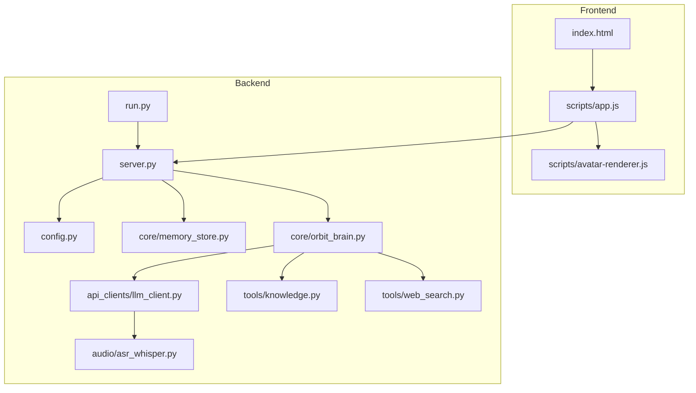
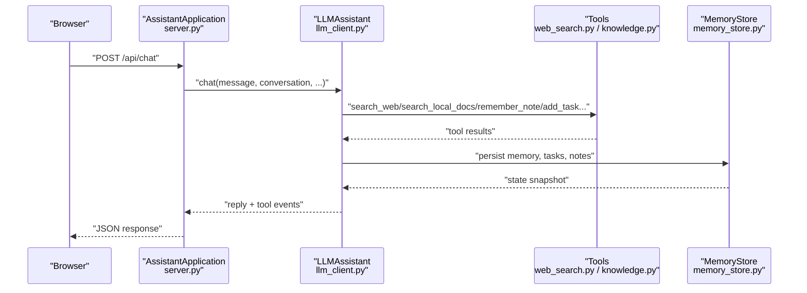

# Troubleshooting and FAQ

<cite>
**Referenced Files in This Document**
- [README.md](file://README.md)
- [requirements.txt](file://requirements.txt)
- [run.py](file://run.py)
- [backend/config.py](file://backend/config.py)
- [backend/server.py](file://backend/server.py)
- [backend/core/memory_store.py](file://backend/core/memory_store.py)
- [backend/core/orbit_brain.py](file://backend/core/orbit_brain.py)
- [backend/api_clients/llm_client.py](file://backend/api_clients/llm_client.py)
- [backend/tools/knowledge.py](file://backend/tools/knowledge.py)
- [backend/tools/web_search.py](file://backend/tools/web_search.py)
- [backend/audio/asr_whisper.py](file://backend/audio/asr_whisper.py)
- [build_knowledge.py](file://build_knowledge.py)
- [frontend/index.html](file://frontend/index.html)
- [frontend/scripts/app.js](file://frontend/scripts/app.js)
- [frontend/scripts/avatar-renderer.js](file://frontend/scripts/avatar-renderer.js)
</cite>

## Table of Contents
1. [Introduction](#introduction)
2. [Project Structure](#project-structure)
3. [Core Components](#core-components)
4. [Architecture Overview](#architecture-overview)
5. [Installation Troubleshooting](#installation-troubleshooting)
6. [Runtime Troubleshooting](#runtime-troubleshooting)
7. [Diagnostic Procedures](#diagnostic-procedures)
8. [Browser Compatibility and Media Issues](#browser-compatibility-and-media-issues)
9. [Frequently Asked Questions (FAQ)](#frequently-asked-questions-faq)
10. [Performance Considerations](#performance-considerations)
11. [Troubleshooting Guide](#troubleshooting-guide)
12. [Conclusion](#conclusion)

## Introduction
This document provides comprehensive troubleshooting and FAQ guidance for the Orbit Virtual Assistant. It focuses on resolving installation issues (dependencies, MongoDB, provider configuration, and RAG setup), runtime problems (server startup, API endpoints, memory storage, and tool services), diagnostics (configuration, performance, and integration), and user-facing issues (browser compatibility, voice input, avatar animations, and network connectivity). It also includes debugging techniques, log analysis guidance, escalation procedures, and answers to common questions.

## Project Structure
The Orbit Virtual Assistant consists of:
- Backend: Python HTTP server, configuration loader, LLM clients, tool integrations (web search, knowledge base), and persistent memory store.
- Frontend: Vanilla JavaScript UI, avatar rendering, voice input, and session management.
- Knowledge Base: Local documents processed for retrieval-augmented generation (RAG).

**Diagram sources**
- [run.py:1-6](file://run.py#L1-L6)
- [backend/server.py:566-611](file://backend/server.py#L566-L611)
- [backend/config.py:55-76](file://backend/config.py#L55-L76)
- [backend/core/memory_store.py:67-118](file://backend/core/memory_store.py#L67-L118)
- [backend/core/orbit_brain.py:389-502](file://backend/core/orbit_brain.py#L389-L502)
- [backend/api_clients/llm_client.py:38-46](file://backend/api_clients/llm_client.py#L38-L46)
- [backend/tools/knowledge.py:88-140](file://backend/tools/knowledge.py#L88-L140)
- [backend/tools/web_search.py:53-105](file://backend/tools/web_search.py#L53-L105)
- [backend/audio/asr_whisper.py:10-19](file://backend/audio/asr_whisper.py#L10-L19)
- [frontend/index.html:1-338](file://frontend/index.html#L1-L338)
- [frontend/scripts/app.js:1-800](file://frontend/scripts/app.js#L1-L800)
- [frontend/scripts/avatar-renderer.js:1-106](file://frontend/scripts/avatar-renderer.js#L1-L106)

**Section sources**
- [README.md:164-201](file://README.md#L164-L201)

## Core Components
- Configuration and environment loading: Loads .env variables and exposes typed settings for providers, ports, and storage.
- HTTP server and routing: Serves static assets and implements REST endpoints for sessions, messages, memory, tools, and chat.
- Memory store: MongoDB-backed persistence for sessions, messages, profile, tasks, notes, and knowledge chunks.
- LLM client: Multi-provider orchestration (Google, OpenRouter, LM Studio, Ollama) with tool calling and error handling.
- Tools: Web search (Tavily + DuckDuckGo), knowledge base (LangChain + FAISS + BM25), weather, and news.
- Frontend app: Chat UI, voice input, avatar animation, screen sharing, and session management.

**Section sources**
- [backend/config.py:55-76](file://backend/config.py#L55-L76)
- [backend/server.py:23-63](file://backend/server.py#L23-L63)
- [backend/core/memory_store.py:67-118](file://backend/core/memory_store.py#L67-L118)
- [backend/api_clients/llm_client.py:38-46](file://backend/api_clients/llm_client.py#L38-L46)
- [backend/tools/knowledge.py:88-140](file://backend/tools/knowledge.py#L88-L140)
- [backend/tools/web_search.py:53-105](file://backend/tools/web_search.py#L53-L105)
- [frontend/scripts/app.js:1-800](file://frontend/scripts/app.js#L1-L800)

## Architecture Overview
The system integrates a browser-based UI with a Python HTTP server. The server initializes memory, knowledge, and tool services, then routes requests to the brain and LLM client. The brain orchestrates tool calls and manages conversation state.

**Diagram sources**
- [backend/server.py:267-321](file://backend/server.py#L267-L321)
- [backend/api_clients/llm_client.py:38-78](file://backend/api_clients/llm_client.py#L38-L78)
- [backend/core/orbit_brain.py:389-502](file://backend/core/orbit_brain.py#L389-L502)
- [backend/tools/web_search.py:69-105](file://backend/tools/web_search.py#L69-L105)
- [backend/tools/knowledge.py:270-298](file://backend/tools/knowledge.py#L270-L298)
- [backend/core/memory_store.py:188-250](file://backend/core/memory_store.py#L188-L250)

## Installation Troubleshooting
Common installation issues and fixes:

- Missing Python dependencies
  - Symptom: Import errors or package not found.
  - Fix: Install dependencies from requirements.txt. For RAG, install optional packages listed under “Optional: Local RAG”.

- MongoDB not installed or not running
  - Symptom: Runtime error indicating inability to connect to MongoDB.
  - Fix: Install MongoDB locally or configure MONGODB_URI to point to a running instance. Confirm the URI and database name in .env.

- RAG prerequisites not met
  - Symptom: Knowledge base initialization fails or LM Studio embeddings unavailable.
  - Fix: Ensure LM Studio is running and reachable at the configured URL. Confirm embeddings model availability. Optionally run the standalone knowledge builder to pre-index documents.

- Web search provider keys missing
  - Symptom: Web search falls back to DuckDuckGo or fails.
  - Fix: Add TAVILY_API_KEY to .env if desired; otherwise DuckDuckGo is used as fallback.

- Port conflicts
  - Symptom: Cannot start the server on the configured port.
  - Fix: Change ASSISTANT_PORT in .env to an available port.

**Section sources**
- [requirements.txt:1-29](file://requirements.txt#L1-L29)
- [backend/core/memory_store.py:86-99](file://backend/core/memory_store.py#L86-L99)
- [backend/tools/knowledge.py:122-138](file://backend/tools/knowledge.py#L122-L138)
- [backend/tools/web_search.py:63-68](file://backend/tools/web_search.py#L63-L68)
- [backend/server.py:608-610](file://backend/server.py#L608-L610)
- [backend/config.py:67-75](file://backend/config.py#L67-L75)

## Runtime Troubleshooting
Server startup and API issues:

- Server fails to start
  - Verify Python version meets the requirement.
  - Ensure .env is present and contains required keys.
  - Check port availability and firewall settings.

- API endpoints return errors
  - Inspect HTTP status codes and JSON error payloads.
  - Common causes: invalid session IDs, missing fields, unsupported tool usage, or provider API errors.

- Memory storage errors
  - Symptoms: connection failures, index creation errors, or write failures.
  - Actions: confirm MongoDB connectivity, verify database permissions, and check index creation logs.

- Tool service failures
  - Web search: verify API key availability and network connectivity.
  - Knowledge base: confirm LM Studio embeddings, document parsing, and chunk storage.

- Unsupported feature handling
  - The server returns a graceful refusal message for unsupported features (e.g., image generation).

**Section sources**
- [backend/server.py:85-168](file://backend/server.py#L85-L168)
- [backend/server.py:169-266](file://backend/server.py#L169-L266)
- [backend/server.py:267-321](file://backend/server.py#L267-L321)
- [backend/core/memory_store.py:86-118](file://backend/core/memory_store.py#L86-L118)
- [backend/tools/web_search.py:69-105](file://backend/tools/web_search.py#L69-L105)
- [backend/tools/knowledge.py:270-298](file://backend/tools/knowledge.py#L270-L298)
- [backend/server.py:255-266](file://backend/server.py#L255-L266)

## Diagnostic Procedures
Configuration diagnostics:
- Validate .env entries for ACTIVE_PROVIDER, AI_MODEL, provider URLs, API keys, and MongoDB settings.
- Confirm provider-specific keys are set when using hosted providers.

Performance diagnostics:
- Monitor tool invocation times and chunk indexing duration.
- Use the knowledge builder’s dry-run mode to preview changes before indexing.

Integration diagnostics:
- Test LLM connectivity by sending a simple chat request.
- Verify tool availability flags (web search only, offline mode) and session-scoped document retriever readiness.

Log analysis guidance:
- Review server logs for HTTP errors, JSON decode failures, and connection aborts.
- Check tool service logs for timeouts, rate limits, and parsing errors.

Escalation procedures:
- Capture request/response payloads and timestamps.
- Collect server logs and tool service outputs.
- Provide environment details (Python version, provider, OS, and dependency versions).

**Section sources**
- [backend/config.py:55-76](file://backend/config.py#L55-L76)
- [backend/server.py:535-564](file://backend/server.py#L535-L564)
- [backend/tools/knowledge.py:189-217](file://backend/tools/knowledge.py#L189-L217)
- [build_knowledge.py:365-381](file://build_knowledge.py#L365-L381)

## Browser Compatibility and Media Issues
Common browser-related issues and resolutions:

- Voice input not working
  - Symptom: Microphone permission denied or speech recognition not supported.
  - Resolution: Ensure HTTPS or localhost, grant microphone permissions, and use a supported browser. The app detects lack of speech recognition and disables voice features accordingly.

- Avatar animation not rendering
  - Symptom: Avatar remains static or shows “No Web Worker” badge.
  - Resolution: Confirm browser supports Web Workers and that the worker script loads. The avatar renderer uses a dedicated worker for animations.

- Screen sharing not functioning
  - Symptom: Screen share button inactive or permission denied.
  - Resolution: Use a secure context (HTTPS/localhost), approve the screen sharing prompt, and ensure the video element is visible.

- Network connectivity problems
  - Symptom: Web search or LLM calls fail intermittently.
  - Resolution: Check firewall/proxy settings, verify API keys, and retry with fallback providers.

**Section sources**
- [frontend/scripts/app.js:538-566](file://frontend/scripts/app.js#L538-L566)
- [frontend/scripts/app.js:601-727](file://frontend/scripts/app.js#L601-L727)
- [frontend/scripts/avatar-renderer.js:1-30](file://frontend/scripts/avatar-renderer.js#L1-L30)
- [frontend/index.html:1-338](file://frontend/index.html#L1-L338)

## Frequently Asked Questions (FAQ)
- Which providers are supported?
  - Supported providers include Google Gemini, OpenRouter, LM Studio, and Ollama. The server prompts for provider selection at startup.

- Privacy and data handling
  - Local RAG runs entirely on your machine when using LM Studio. No documents are sent to external APIs. Web search results are treated as data only and do not override system safety rules.

- Feature availability
  - Some features (e.g., image generation) are intentionally unsupported and return a graceful refusal message. Offline mode disables web search.

- Upgrading and dependencies
  - Keep dependencies updated according to requirements.txt. For RAG, ensure optional packages are installed. Use the knowledge builder to maintain the knowledge base.

- How do I pre-index documents for RAG?
  - Use the standalone knowledge builder to scan, compare, and index documents into MongoDB. You can rebuild, clear, or verify the retriever.

**Section sources**
- [README.md:17-51](file://README.md#L17-L51)
- [README.md:205-212](file://README.md#L205-L212)
- [backend/server.py:574-590](file://backend/server.py#L574-L590)
- [build_knowledge.py:1-13](file://build_knowledge.py#L1-L13)
- [build_knowledge.py:217-271](file://build_knowledge.py#L217-L271)

## Performance Considerations
- MongoDB connection timeouts and retries are configured to fail fast; ensure low-latency local connections.
- RAG indexing can be time-consuming for large document sets; use incremental updates and the knowledge builder’s dry-run mode.
- Web search calls may be slow or rate-limited; Tavily is preferred when available, with DuckDuckGo as fallback.
- Tool loop limits prevent infinite iterations; adjust expectations for complex multi-tool workflows.

[No sources needed since this section provides general guidance]

## Troubleshooting Guide
Step-by-step troubleshooting checklist:

- Installation
  - Confirm Python version and install dependencies.
  - Start MongoDB and verify connectivity.
  - Set provider keys and URLs in .env.
  - Enable RAG only if LM Studio and optional packages are available.

- Startup
  - Run the server and select provider and RAG options.
  - Check for port binding and firewall issues.

- API
  - Validate endpoint payloads and required fields.
  - Inspect error responses and HTTP status codes.
  - Test chat endpoint with minimal input.

- Storage
  - Verify MongoDB indexes and collections.
  - Check for lock contention and concurrent writes.

- Tools
  - Test web search and knowledge base retrieval independently.
  - Confirm LM Studio embeddings and FAISS availability.

- Frontend
  - Ensure HTTPS or localhost for media features.
  - Confirm Web Worker support and avatar worker loading.
  - Validate microphone permissions and screen sharing prompts.

- Diagnostics
  - Capture request/response logs and timestamps.
  - Use knowledge builder to inspect chunk counts and verify retriever health.

**Section sources**
- [backend/server.py:566-611](file://backend/server.py#L566-L611)
- [backend/core/memory_store.py:119-135](file://backend/core/memory_store.py#L119-L135)
- [backend/tools/web_search.py:69-105](file://backend/tools/web_search.py#L69-L105)
- [backend/tools/knowledge.py:220-230](file://backend/tools/knowledge.py#L220-L230)
- [frontend/scripts/app.js:538-566](file://frontend/scripts/app.js#L538-L566)
- [build_knowledge.py:390-428](file://build_knowledge.py#L390-L428)

## Conclusion
By following this troubleshooting guide, you can diagnose and resolve most installation, runtime, and integration issues in the Orbit Virtual Assistant. Use the diagnostic procedures to isolate configuration, performance, and provider-specific problems, and escalate with logs and environment details when needed.